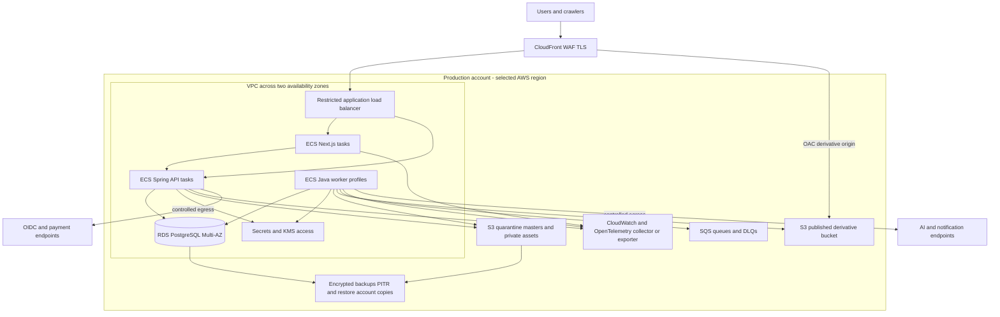

# Phase 01 — Deployment, Environments, Operations and Cost

Status: selected reference architecture; no resources provisioned, no build/container or deployment completed. Related: [production](01_PRODUCTION_ARCHITECTURE.md), [security](01_SECURITY_ARCHITECTURE.md), [media/AI](01_MEDIA_AI_ARCHITECTURE.md), [testing](01_TESTING_STRATEGY.md). Requirements: ARCH-001–004, SEC-005, BACKUP-001–002, OBS-001–003, PERF-001–003, BILL-001–003.

## 1. Production topology

Select AWS regional deployment (initial candidate ap-south-1/Mumbai for India-first latency), ECS Fargate Linux containers, RDS PostgreSQL18.6, S3, CloudFront/WAF, SQS Standard and managed secrets/KMS. Region/engine-version availability and identity/provider residency terms are provisioning gates; no unsupported equivalence or data-residency compliance claim. Multi-AZ inside one region for production; multi-region active/active is not justified. Only global CDN and provider dependencies cross that regional boundary as explicitly contracted.

Tasks have no public inbound exposure; ALB accepts only approved edge traffic using network/origin controls and validated headers, not a guessed origin secret alone. API routes go directly through same-origin edge/ALB to Spring; web SSR uses private discovery endpoint. CloudFront behavior prioritizes `/api/*`, backend `/auth/oidc/*` and private grant/media routes with caching disabled and correct cookies/method forwarding. Static `/_next/static/*` can use immutable caching. Public HTML remains unshared SSR initially; derivative CDN follows its revocation policy.

Private subnets for tasks/database; DB ingress only approved API/worker/migration identities and network groups. Controlled outbound HTTPS for provider calls, S3 endpoints and reviewed service endpoints. NAT/endpoint count must be costed; don't add one endpoint per service blindly. Production egress availability must match failure objectives; a single NAT creates an explicit dependency risk, not hidden HA. Decoding subprocess sandbox has **no** provider/cloud egress or task-credential endpoint access even though its orchestrator can access storage.

Small startup: one web/API task each may serve a non-HA pilot with documented deployment interruption. Full paid-production target is two web/API replicas across zones, RDS Multi-AZ, and independently bounded worker concurrency; no one deployment per domain. Worker profiles scale by age/backlog and memory/CPU, with AI concurrency capped by tenant/provider/budget rather than raw queue size. Media can use burst capacity where retry-safe; avoid interruptible execution for unreconciled billable submission without recovery proof. No Kubernetes/service mesh.

No tenant custom-domain onboarding is implemented now. The public host abstraction permits later TLS/edge hostname automation. Specific high-volume custom-domain certificate/distribution strategy is V1.5 selection work; default platform host and media host use owned certificates. Customer domains do not inherit platform HSTS/preload/cookie assumptions.

## 2. Environment isolation

| Environment | Infrastructure/data | External providers | Access |
|---|---|---|---|
| LOCAL | Loopback-bound Compose PostgreSQL; emulated object/queue services when needed; synthetic data | Local fake adapters in test/dev only; no production tokens | Developer machine, isolated local credentials |
| TEST | Ephemeral PostgreSQL/Testcontainers and protocol emulators; disposable fixtures | Deterministic failure-capable test doubles; dedicated sandbox contract job separately | CI short-lived identity; no production secrets |
| STAGING | Separate account or equally strong account/IAM boundary, actual S3/SQS/CDN and production-equivalent policies; smaller compute | Dedicated sandbox or capped test accounts, distinct webhook keys | Staff access plus controlled test crawler; noindex and access protection |
| PRODUCTION | Dedicated account/network/secrets/buckets/DB/queues/keys/backups | Explicit production credentials and billing-enabled gates | Least privilege, MFA/approval-protected deployment and audited operations |

No production credentials/data copied locally. If production debugging samples are needed, use approved sanitized fixtures. DNS, queue IDs, secret namespaces, provider account IDs and webhook targets must be distinct across environments. Startup validates declared environment and allowed cloud/provider account IDs; production charge capability defaults off outside production. A test key containing a live endpoint cannot override this check silently.

## 3. Local reproducibility and future environment conventions

Docker Compose is selected for local infrastructure, not a local Kubernetes cluster. Add a PostgreSQL18.6 service first when schema implementation starts, persistent named volume, readiness and loopback-only port. Add one S3/SQS protocol emulator profile when19 requires it, and a local email capture service when07/notifications requires it. Emulator product/version/license must be qualified at first use; tests against real staging S3/SQS remain mandatory because emulators cannot prove IAM/OAC/visibility semantics. No Redis container initially. Run web and Java API with native hot-reload commands; workers opt-in profile. Never create empty services just to match a diagram.

Current host has Node22.18.0/npm10.9.3/Java18.0.2.1 and no Maven/Docker on PATH. Required setup: approved Node24.21.0, Temurin25.0.4.1, Docker with Linux containers if using local infra, then checked-in Maven3.9.16 wrapper and exact npm lockfile when builds exist. No installations were attempted; executable setup and compatibility are later implementation prerequisites. Windows PowerShell scripts must use literal paths and no destructive cross-shell cleanup.

Future `.env.example` files contain **names and placeholders only**, live `.env*` ignored except explicit examples. Validate config once at startup, fail with missing key names without printing values. Nonsecret browser values are intentionally prefixed NEXT_PUBLIC_; database URLs, identity clients, API origin internals, signing material and provider keys never use that prefix.

| Configuration group | Future example names | Source / rule |
|---|---|---|
| Runtime | APP_ENV, PUBLIC_APP_ORIGIN, API_INTERNAL_ORIGIN, ALLOWED_HOSTS | Validated deployment configuration; no open upstream proxy |
| Database | DB_HOST, DB_PORT, DB_NAME, DB_USERNAME, DB_PASSWORD_SECRET_REF | Separate runtime/migration user; resolve secret at runtime |
| Storage | OBJECT_STORE_REGION, QUARANTINE_BUCKET, MASTERS_BUCKET, PRIVATE_BUCKET, DERIVATIVE_BUCKET, MEDIA_PUBLIC_ORIGIN | Nonsecret resource names; task-role credentials, no embedded keys |
| Queue | QUEUE_MEDIA_URL, QUEUE_AI_URL, QUEUE_NOTIFY_URL, QUEUE_PROJECTION_URL, QUEUE_ANALYTICS_URL | Exact environment/account allowlist |
| Identity | OIDC_ISSUER, OIDC_CLIENT_ID, OIDC_CLIENT_SECRET_REF, OIDC_CALLBACK_ORIGIN | Server only; validated provider metadata |
| Providers | AI_PROVIDER, AI_CREDENTIAL_SECRET_REF, PAYMENT_PROVIDER, PAYMENT_WEBHOOK_SECRET_REF, EMAIL_PROVIDER | Explicit env-scoped adapters, defaults disabled until configured |
| Telemetry | OTEL_SERVICE_NAME, OTEL_EXPORTER_OTLP_ENDPOINT, LOG_LEVEL | No secret/PII label values; production debug disabled |
| Limits/flags | CONFIG_VERSION, BILLING_LIVE_ENABLED | Reviewed server configuration; actual entitlements/flags versioned in DB |

No actual `.env.example` is generated yet because runnable consumers/config schema do not exist; this table is the convention, not a claim of usable configuration. First scaffold must add native commands, lockfiles, runtime pins and health checks together, not “success” scripts that do nothing.

## 4. CI/CD and migration safety

Selected workflow platform: GitHub Actions once repository/remote exists. Git has not been initialized and no remote supplied in this phase. Commit the documents/foundation using the user's chosen repository setup before code work; don't create an external repository silently.

PR pipeline: formatting/Markdown checks → native frontend lint/type/unit/component and backend unit/application/architecture tests → secret/dependency/SAST/license checks → web/API/worker builds → PostgreSQL/storage/queue/API integration and selected E2E → SBOM and signed immutable container artifacts. Parallelize independent native builds while integration waits for successful artifacts. Pin actions by commit and toolchains/containers by reviewed version/digest. Required scans cannot be disabled to make a build pass. Security exceptions need owner/expiry and cannot waive critical tenant/original exposure.

Deploy same artifact digest to staging → migration preflight → migrate once with dedicated job/role → compatible service rollout → smoke/security/crawl/queue checks → explicit production environment promotion gate → production migration/rollout → monitor health/rollback criteria. No rebuild with different dependencies between environments. Deployment automation is a future implementation, not a Phase01 action.

Migration policy: Flyway checksums, expand/contract, backward-compatible columns/events until all consumers upgrade; bounded lock timeout and transaction-aware script design. Rehearse from empty DB and latest production-like snapshot; assess large-table index/backfill impact. Use separate concurrent-index scripts where required instead of wrapping incompatible DDL in a transaction. Backup/PITR status must be healthy before irreversible change. On migration failure, halt deployment and leave compatible old service; no automatic partial “repair” or destructive down script. Roll back application only if schema remains compatible; otherwise forward-fix under incident procedure. Schema contract-removal has an explicit later release gate.

## 5. Observability and operating targets

Structured JSON logs plus request ID and W3C trace context across API/outbox/worker/provider. OpenTelemetry instrumentation/export format reduces sink lock-in; startup uses CloudWatch logs/metrics/alerts and limited sampled tracing rather than operating an entire telemetry cluster. Dedicated exception SaaS is optional later. Every process emits health/readiness and version/build information internally. Probes must not reveal credentials or private tenant data.

Metrics: API p50/p95/p99 latency and5xx, DB latency/pool wait/locks/connections, queue age/depth/DLQ/lease losses, worker success/failure/duration, AI model latency/cost/unknown outcomes, media/watermark failures, storage/quota growth, login/MFA/rate-limit events, webhook/payment reconciliation failures and cache/publication lag. Avoid user/tenant IDs as unbounded metric labels; tenant drill-down uses restricted structured records. Prompts/photos/phone/token/signed URL values are excluded. Audit and analytics have their own access/retention purposes.

Initial operational targets to qualify at29: public and core API availability99.9% monthly excluding declared planned pilot limitations; public-read projection p95≤200ms, search≤300ms, common authenticated CRUD p95≤500ms excluding provider jobs; outbox publication lag p95≤30s; CDN takedown target≤5min; transactional RPO≤15min/RTO≤4h. These are design objectives, not contracted SLA claims or measured results.

Alerts: sustained5xx/latency/error-budget burn, oldest pending job above accepted UX deadline, any watermark/public-source violation, audit append failure, admin anomalies, DLQ growth, provider unknown outcome beyond reconciliation threshold, unexpected daily AI spend and missing backup/PITR checkpoint. Every alert has an owner/runbook/action rather than always notifying on normal events. Phase29 assigns actual operational people/on-call before launch.

## 6. Backup, recovery and deletion

RDS automated encrypted backups/PITR with proposed35-day retention; protect deletion of backup infrastructure; keep restricted separate-account recovery copies where supported and costed. S3 versioning/lifecycle and optional replication protect masters, but old versions must also follow user deletion/legal policy; versioning alone is not backup and cannot revoke downloaded files. Track asset/checksum manifest against DB revisions and report replication lag. DB RPO does not promise every unreplicated media byte meets the same recovery point.

Quarterly restore drills plus before first production: restore DB to isolated environment, restore/check media references, reapply deletion/tenant suspension tombstones, disable live providers/notifications, replay/reconcile outbox/job/payment ledgers carefully, rebuild search/cache/aggregates, verify cross-tenant/privacy policies, measure elapsed RTO and actual recovery point. DNS/secret/key recovery and cloud account access are part of drill. Never replay financial/AI side effects blindly after restore. User trash restore is a separate product operation and cannot serve as backup evidence.

Deletion pipeline deactivates/revokes first, then durable owner-specific cleanup/purge/provider deletion and public cache invalidation. Audit/financial records with retention obligations are restricted/pseudonymized per reviewed policy rather than destroyed by cascade. Backup tombstones remain until all recoverable copies age out. Legal/jurisdiction-specific retention review is due before data/paid launch, not asserted here as legal advice.

## 7. Failure-mode matrix

| Failure | User-visible behavior | Data/charge protection | Recovery and signal |
|---|---|---|---|
| PostgreSQL unavailable | Protected actions and live-public SSR return503; static assets may serve, no false404 | No auth/entitlement/publish acceptance without authority; no credit settlement | Halt consumers requiring state; alert DB/readiness; reconnect bounded; reconcile external in-flight work |
| Redis unavailable if later added | Core truth stays in PG; bypass safe read caches; sensitive limiter/session cache falls back to authority or503 | Redis is never ledger or sole lock; no unlimited billable fail-open | Circuit-break cache, avoid stampede, restore without data migration |
| Object storage unavailable | New grants/process/download/publish unavailable or accepted job visibly waiting | No clean-original fallback; don't mark READY/success before durable output | Idempotent processing retry; reconcile pending bytes/orphan intents |
| CDN unavailable | Public image/static delivery degraded; error/fallback placeholders | Never redirect to private origin/bucket; origin remains protected | Vendor alert; approved alternate derivative-only distribution via runbook if needed |
| AI provider unavailable | New submissions limited/paused, queued status truthful, confirmed failure safely reported | Reservations released only on known failure; ambiguous submits RECONCILING | Circuit breaker, bounded safe retries, status lookup/manual resolution, spend alert |
| Queue unavailable | Committed business events remain in outbox; accepted jobs wait with backlog limit; analytics202 not returned without durable accept | No loss after acknowledgement; cannot assume processing began | Relay backoff, outbox-age alert, destination dedup on replay |
| Email/SMS/notification provider unavailable | Lead/account event remains stored; notification pending; verification-dependent access stays restricted | No loss of lead or grant of unverified access; no duplicate OTP issuance on retry | Retry/delivery reconciliation, expiry-aware regeneration and provider alert |
| Payment provider unavailable | Checkout may be unavailable/pending; previously valid subscription policy follows authoritative ledger | No grant from redirect; webhook durable inbox or retryable response; no double settlement | Provider reconciliation and user-visible pending state; support runbook |
| Image validation/processing fails | Asset FAILED with safe actionable reason and retry/re-upload options | No READY/public manifest; intermediates private; retain original only if validated | Decoder logs redacted; bounded retries only for transient cases; failure metric |
| Watermark processing fails | Publish blocked; previously approved watermarked version can remain live | Never substitute clean source/unmarked thumbnail | Retry recipe or fix logo; alert and manual inspection |
| OIDC provider unavailable | New login/step-up unavailable; existing local sessions valid only within bounded policy | No bypass of MFA/expired sessions; local logout still works | Provider health alert; revoke locally when needed |
| Cache/search projection consumer lags | Public data uses live eligibility; some new content may not be discoverable yet | Withdrawn/private content filtered at serve time | Outbox/projection lag alert and rebuild/replay |

No degraded path silently claims success or drops acknowledged transactional data. Public analytics can be lossy before acknowledgement; this is explicit and observable, not confused with billing or lead data.

## 8. Startup versus scale-up costs

No prices/free-tier entitlements assumed. Obtain dated regional quotes using expected workload before provisioning. Estimate monthly cost from units below plus fixed compute/load-balancer/network/tax costs. AI and provider tests must be capped. Architecture may be revisited before spend if baseline exceeds budget, through ADR without weakening security.

| Cost center | Startup approach | Scale-up approach / trigger |
|---|---|---|
| AI generation | One evaluated adapter, private bounded inputs, credit reservation, tenant concurrency and daily spend cap; track actual attempt cost | Provider/model routing by measured quality/cost, reserved capacity only after stable volume; preserve reconciliation |
| Object storage | One region, separated policy buckets, reuse masters, bounded recipes and orphan/retention cleanup | Tier rarely read masters where recovery latency permits, lifecycle/replication based on measured risk |
| CDN bandwidth | Responsive sizes, limited hero payload, derivative-only CDN and measured cache hits | Origin shield/multi-CDN only with demonstrated egress/availability benefit; revocation policy remains |
| Image processing | Async bounded workers, precompute required sizes, recipe dedup; no per-view watermark CPU | Separate media autoscaling and native/managed benchmark on actual throughput |
| Database | Managed modest PostgreSQL instance, indexed queries, bounded connections, Multi-AZ for full production | Scale vertically/read replicas/partitioning after query profiling; no sharding by default |
| Redis | **No initial instance**; PG sessions and narrow sensitive counters, edge throttling | Managed Redis-compatible cache only after measured latency/DB contention; never primary ledger |
| Queue | Managed SQS per-purpose queues, long polling, batch safe deliveries, bounded retry | Tune batching/concurrency; no Kafka unless real streaming requirement |
| Monitoring | Built-in logs/metrics, privacy redaction, sampled traces, retention caps and low-cardinality labels | Dedicated observability vendor only when diagnostic value justifies ingest/retention cost |
| Email/SMS/WhatsApp | Transactional email adapter, OTP anti-abuse and minimal SMS; V1 user-initiated WhatsApp links | Provider routing/official Business integration when authorized release and volume justify |
| Search | PostgreSQL indexed public projection | Dedicated engine only after optimized query/relevance criteria fail |
| Compute/network | Three application types, no microservice fleet; small staging scheduled down; cost NAT/ALB/endpoints explicitly | Autoscale web/API/pools independently with tested concurrency/connection budgets |
| Identity | Managed OIDC avoids running an identity cluster; compare active-user/OTP/MFA cost before03 | Exportable identity mapping/provider migration plan; dedicated self-hosting only via justified ADR |

Cost model inputs: monthly visits × delivered bytes; source/variant bytes × retention; attempts × provider cost; image jobs × CPU seconds; database/compute hours; queue messages including retries/fan-out; notification destination count; telemetry GB. Report cost per active studio, published project and successful AI concept as well as total bill. Margins/prices remain a later business decision.

## 9. Deferred selections and gates

Core deployment choices (AWS/Fargate/RDS/S3/CloudFront/SQS) are selected, not listed as open vendors. Final resource size/region availability and exact immutable image digests are provisioning qualifications. Identity vendor due03 before login implementation; AI model/vendor due21 after quality/privacy/cost evaluation; payment vendor due28 before paid launch; email provider due07 for real verification and later notification integration, SMS before OTP and official WhatsApp only future authorized scope. Decoder/codecs due19; custom-domain TLS onboarding product dueV1.5; optional telemetry vendor and Redis/dedicated search vendor only if measured need. No open choice prevents Phase02 domain modeling.
