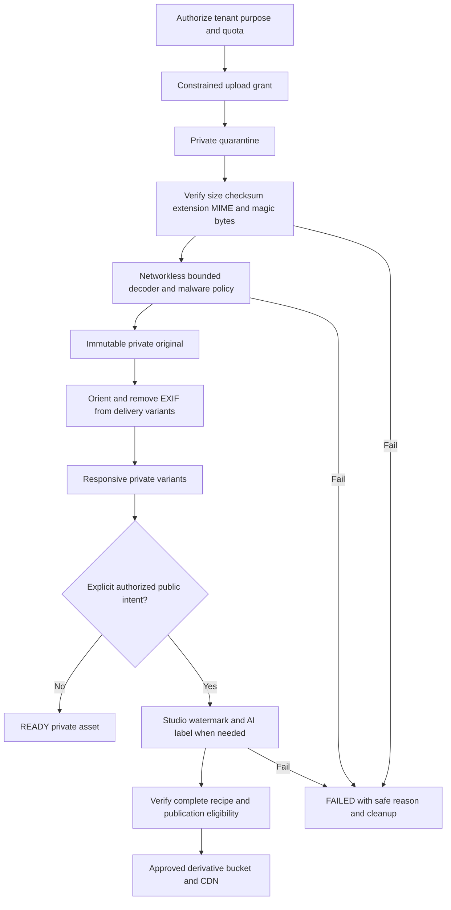
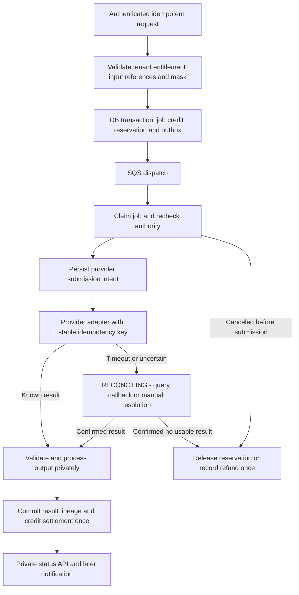

# Phase 01 — Media, Watermark, Queue and AI Architecture

Status: selected architecture only. No media processing or provider integration implemented. Traceability: MEDIA-001–006, WM-001–004, AI-001–008, REF-001–003, MASK-001–002, COLLAB-001–003, SEC-006–008, STORE-001–002, PERF-001, BILL-002. [Security](01_SECURITY_ARCHITECTURE.md) and [module boundaries](01_MODULE_BOUNDARIES.md) define authority; [SEO](01_SEO_RENDERING_ARCHITECTURE.md) defines publication consumers.

## 1. Logical assets and physical isolation

S3 API behind ObjectStore is selected; initial production adapter AWS S3. Separate environment-specific buckets and IAM policies for quarantine, private masters, private processed assets and published derivatives. Logical private types (AI input/reference/mask/client review) share private storage only with explicit per-asset metadata/policy; a folder name cannot grant access. All buckets block public access; “public” means CloudFront-readable approved derivatives, not an open bucket.

| Storage zone | Writers | Readers | Exclusions |
|---|---|---|---|
| Quarantine | Short-lived constrained browser upload grant; media ingestion | Validation worker only plus operational quarantine tooling | No CDN/API public downloads; expiry cleans abandoned multipart objects |
| Private masters | Validating media worker conditional create | Authorized media processing/owner download gateway | No CDN, public Next image optimizer or browser bucket listing |
| Private processed | Media/AI orchestration worker | Scoped private gateway and provider-input adapter | AI inputs/references/masks/results remain private unless separate public derivative approved |
| Published derivatives | Media publisher after eligibility gate | CDN origin access control only; managed takedown tooling | No originals; no generic worker/public write endpoint |

Object keys use independently random IDs, not customer names, filenames, addresses or slugs: `q/{uploadId}/{randomObjectId}`, `m/{assetId}/{randomObjectId}`, `d/{assetId}/{recipeHash}/{variantId}.{format}`. TenantId is in authoritative metadata and may be a partition prefix internally if required; no client authorization depends on path obscurity. Public URL maps an opaque delivery ID plus recipe/size/version, never a transform parameter revealing a master key. Project associations are DB usages, not storage folder ownership—one asset can be reused safely across owned projects.

MediaAsset metadata includes tenant, opaque ID, content kind/provenance, usage roles, access classification, original checksum/bytes/dimensions/orientation/content type, original key internal-only, uploader, processing state/version, retention state and time. MediaVariant includes parent/recipe/config version, dimensions/format/bytes/checksum, watermark/AI-label attestations and delivery state. MediaUsage carries project/version/section/reference purpose and order/caption/alt/focal point. Schema/entities are Phase02/19 work.

Bucket policies deny insecure transport and unauthorized principals. Private encryption keys/grants are separate from public derivative access. CDN OAC is bound to the particular distribution and derivative bucket ([AWS OAC reference](https://docs.aws.amazon.com/AmazonCloudFront/latest/DeveloperGuide/private-content-restricting-access-to-s3.html)). Workloads have only needed bucket actions; no wildcard account-wide S3 rights. Audit reads of clean masters separately from public derivative fetches.

## 2. Upload and media states

Canonical internal lifecycle retains master states: UPLOADING → QUARANTINED → VALIDATING → PROCESSING → READY or FAILED; recoverable TRASHED, terminal PURGED. The Phase01 example UPLOADED maps to QUARANTINED, and DELETED maps to a presentation state with recoverable/terminal detail. Do not create a second state machine. READY means safely processed, **not public**. Visibility and publication readiness are separate.

Initialization authenticates/authorizes purpose and atomically reserves pending bytes. Initial image policy: JPEG/PNG/WebP; max25MiB/source,40megapixels, bounded frame count (animated inputs rejected initially), max10 references/job subject to provider lower limits. These are safety defaults for Phase19 validation, not pricing. Video has an independent bounded ingestion/transcode design and explicit product constraints before enablement; don't pretend an image decoder handles videos/plans. SVG logos must be rasterized/sanitized in a qualified pipeline or rejected with usable guidance. No ZIP/executable intake.

Use exact-key presigned POST with content-length range where supported; default5min expiry. Multipart/resume uses upload ID, bounded part grants, per-tenant pending-byte ceiling and server completion/checksum verification. Browser MIME/extension are only hints. Completion is idempotent and validates actual bytes, ownership, expected key and grant; rejected oversize files never become masters. Expired/canceled pending reservations release only after object cleanup/accounting reconciliation. Reusing a presigned upload cannot overwrite an accepted master: quarantine upload/version is pinned and worker copies an exact validated version/checksum to a conditional-create unique master. Input is not decoded inline in normal HTTP requests.

Validate format/magic and decode under CPU/memory/time/pixel limits; malware checks based on content risk; disable network/protocol features in native libraries; process with unprivileged UID, clean environment/no cloud credentials, no access to task metadata endpoint, bounded temporary directory and no shell-built commands. Orchestrator stages only necessary files and invokes fixed argument lists. Linux worker sandbox/seccomp/network enforcement must be qualified before launch. Prefer Java orchestration with a small vetted **libvips-based native processing adapter** for responsive formats; exact binaries/codecs/license/security pin is Phase19 work. Compare managed transforms only if sandbox operation is uneconomic, preserving private originals and watermark invariants. No Python application runtime now.

Masters remain byte-preserving and immutable during normal use; EXIF/geolocation is removed from every delivery/provider-input variant. Immutable does not mean retained against deletion rights. Reprocessing reads masters and creates new keys; no in-place overwrite. Algorithm checksums and recipe IDs prevent retry duplicates; failed intermediates are private and cleaned on schedule.

## 3. Watermarks, public delivery and revocation

Designer configuration supports logo/name/both, bottom-right/default/bottom-left/top-right/center/tiled, bounded relative scale/opacity and preview. Business-name fallback is mandatory if logo missing/unusable. Limits ensure watermark cannot be effectively invisible; exact style bounds and visual fixtures are decided in19. Persist config version and logo asset version. Normal photographs get watermark; AI concepts also get visible AI Concept Visualization identification. Private content is not made public merely because it has a logo.

Generate size-specific watermarks after resizing so text/logo remains legible even on thumbnail/OG images. Recipe includes normalized source checksum, focal crop, widths, codecs, encoder parameters, watermark/logo version and AI label version. Variants initially planned at320/640/960/1440/1920 px as needed without upscaling; AVIF/WebP plus JPEG/PNG fallback according to real codec output. `<picture>`/srcset/sizes and dimensions use only precomputed eligible derivatives. No request-time expensive public transformation service and no public arbitrary source URL optimizer.

Changing watermark creates a new recipe generation with priority for currently published usages, then atomically updates their publication manifest after all required variants pass. Old recipe remains watermarked while regeneration is pending; retiring old assets invalidates CDN delivery references. Do not require original re-upload or swap to a clean source when processing fails. Published library usage and active recipe manifests are explicit so theme/OG/social export consumers cannot bypass policy.

Public derivative keys are content-versioned (never overwritten), but cache **policy is revocable**, not an unconditional one-year browser immutable promise. Start browser `max-age=0,must-revalidate`; CDN `s-maxage=300` with bounded cache TTL and no stale-on-error for withdrawn content. Delete/deny retired origins and invalidate CDN keys on unpublish/moderation; track the purge operation to completion. Public HTML stops showing withdrawn assets through the live publication gate immediately after commit; already cached derivative bytes have a bounded invalidation/TTL window. Display takedown as pending until completion, alert if it exceeds5min, and document that downloaded copies cannot be recalled. Strong private revocation instead uses no-cache live authorization on every new request; never serve private shares from the public derivative host. Client/public cache TTL targets are enforced with real CDN tests in19/20.

## 4. Queue selection and worker execution

| Option | Startup trade-off | Decision |
|---|---|---|
| In-process async/fire-and-forget | Simple but loses work on deploy/crash | Rejected for durable work |
| PostgreSQL job polling only | Lowest extra infrastructure; competes with database and needs lease/DLQ tooling | Valid small alternative, not selected transport; DB remains job/outbox authority |
| Redis queues | Extra state service plus persistence/eviction operational burden | Not selected; Redis not primary durable job store |
| RabbitMQ | Flexible routing, but cluster/patch/availability management | Not justified initially |
| Kafka | Streaming replay throughput beyond present need | Rejected for V1 complexity |
| SQS Standard | Managed durability and usage-based requests; duplicate/out-of-order delivery must be handled | **Selected**, behind QueueTransport with per-purpose queue/DLQ |

Queues: media, AI execution/reconciliation, notifications, public-projection/cache updates and analytics batches. Outbox fan-out dispatch ledger records destination-specific delivery, not one queue mistakenly used as broadcast. Queue payload carries job/event ID, schemaVersion, tenant ID, trace ID and expected aggregate version—not original/reference URLs, prompt text or secrets. Encrypted transport/storage and scoped sender/consumer IAM. Job DB holds detailed protected payload/state.

Consumers atomically claim a DB lease/fencing epoch, validate tenant/resource current state, heartbeat both lease and broker visibility, and commit result before deleting the message. A receipt handle or visibility timeout is not an exactly-once lock. Duplicate messages consult job outcome and dedup rows. Out-of-order messages cannot regress versions. Normal transient retries: up to5 attempts with exponential backoff/jitter; permanent validation/policy failures do not retry. DLQ receives exhausted transport work and alerts with safe failure category; manual replay requires permission, reason and idempotency review.

AI submit is a special case: once external submission may have occurred, do not use ordinary retry rules. Transition to RECONCILING; receipt deletion is permitted only after a durable reconciliation job/outbox intent exists. Long provider jobs use submit/status polling or signed provider callback plus reconcile queue, rather than holding one broker lease indefinitely. AWS documents [at-least-once delivery](https://docs.aws.amazon.com/AWSSimpleQueueService/latest/SQSDeveloperGuide/standard-queues-at-least-once-delivery.html) and [visibility limits/duplicate considerations](https://docs.aws.amazon.com/AWSSimpleQueueService/latest/SQSDeveloperGuide/sqs-visibility-timeout.html); database fencing/idempotency is still required.

Status, age, attempt count, heartbeat loss, queue age/depth, DLQ count, delivery lag and cost/latency are observable. Queue outage leaves outbox intents pending; UI can report accepted-but-waiting only after durable DB commit and within bounded backlog limits. Stop accepting new AI work when lag/pending quota exceeds configured safety ceiling. No claim that a queued job began execution merely because HTTP returned202.

## 5. AI provider contract

`ImageGenerationProvider` has capability discovery and semantic operations `editImage`, `generateVariation`, `editWithMask`, `useReferences`, plus submit/status/cancel/reconcile where supported. One implementation may translate all into one vendor endpoint. Capability fields include accepted formats/dimensions, max references, mask convention, approximate preservation behavior, timeout/cancel support, provider idempotency and cost/retention semantics. Unsupported requested capability is rejected before reserving/charging or explicitly offered as a different operation; never silently discard a mask/reference.

Store provider ID, model/version, operation, provider request/idempotency IDs, job and attempt states, input/reference/mask immutable IDs+hashes, parameters/prompt under restricted access, start/end times, latency, provider usage/cost metadata with currency/precision, failure category and output asset IDs. Credential references resolve via secret manager; no provider secret in database metadata/logs/events. Raw request/response bodies are not general telemetry. Failure taxonomy VALIDATION, POLICY, QUOTA, TRANSIENT_PROVIDER, PROVIDER_REJECTED, UNKNOWN_OUTCOME, OUTPUT_INVALID, STORAGE, INTERNAL.

Provider selection is deferred until Phase21's representative unfinished-interior evaluation and contract/privacy/cost review. Benchmark structure/perspective preservation, masked boundaries, color/material/handle targeting, latency, concurrency, commercial rights and data retention. Provider substitution must keep truth labels and show capability differences. No exact physical color, geometry or material promise.

## 6. AI job, credits and uncertain outcomes

Canonical internal lifecycle: CREATED → RESERVED → QUEUED → RUNNING → SUCCEEDED / FAILED / CANCELED, plus RECONCILING for uncertain external state. External API maps RUNNING to PROCESSING and CANCELED to CANCELLED; includes RECONCILING explicitly with human-readable status. Reservation/submission substate is retained internally rather than losing evidence. CREATED/RESERVED/QUEUED are committed atomically before success acknowledgement; invalid input/quota returns an error with no dangling billable job.

Credit policy: user credits settle only once a usable validated private output is durably stored and success is committed. Confirmed non-billable failure releases reservation. If provider charges but output is unusable, platform absorbs vendor cost under this starting policy; record vendor cost separately and alert. Changing charging policy requires explicit product/billing ADR and disclosure. Never charge from browser status or analytics.

Retry semantics:

1. Before provider submission, bounded safe retries preserve same logical job/reservation/key.
2. Persist submission intent/attempt before network call. Timeout or worker death afterward is UNKNOWN_OUTCOME even without a returned request ID. A provider with stable idempotency lookup may be reconciled; without it, hold and investigate, never blindly resubmit billable work.
3. If callback and poll race, unique provider attempt/job and ledger constraints settle once. Validate callback signature/account/event binding before accepting data.
4. If DB fails after result download, stage result at deterministic private job/attempt key with checksum; recovery discovers it and reconciles. Do not submit again because settlement failed.
5. Reservation expiry never auto-refunds a possibly running provider job. Reconciliation has an operational deadline (target24h) and alert owner; manual resolution records evidence and exact ledger adjustment. No invisible indefinite holds.
6. Cancellation before external submission releases credits. During submission, record cancel requested, attempt vendor cancellation, then reconcile; if a usable result completed despite cancellation, preserve it and follow disclosed completion policy rather than claiming confirmed cancellation. No double refund/charge.

Clients poll a tenant-scoped status endpoint with backoff and visibility pause initially; SSE can be added for real need with identical authorization and resume semantics. Refreshing/retrying the mobile UI never creates a second job when the idempotency key is reused. History variants create child generation records and independent input snapshots, never overwrite prior good results.

## 7. References, masks and public concepts

Each input link has role MAIN_IMAGE, REFERENCE_COLOUR, REFERENCE_MATERIAL, REFERENCE_HANDLE, REFERENCE_DESIGN or MASK; reference subtype covers laminate/wood/marble/door style/inspiration, apply-to target and optional instruction. Verify every reference is READY private, same tenant/authorized purpose, not deleted, and within total bytes/provider limits. AI input made from a formerly public project still uses an authorized private processing variant; no presumption that any public URL can be scraped.

Reference precedence and conflicts are explicit, with generic-color guidance and physical-material caveat. Mask orientation/coordinate normalization is tied to the main image checksum/dimensions, with a provider adapter converting white/black/alpha semantics. Brush/erase/rectangle/undo/reset are frontend interactions in23, not implemented here. Mask editing aims to preserve unselected regions; quality validation and capability gates prevent claims of mathematical exactness.

AI concepts are PRIVATE by default. Explicit Publish to Project requests validate ownership and create required watermarked/AI-labeled derivatives; mark usage AI_CONCEPT with correct metadata. A private READY result or watermarked preview is insufficient for publication. Public AI concept thumbnails, OG cards and exports retain labels. Before → AI → Actual joins retain provenance so AI never silently becomes actual completed work.

## 8. Failure and recovery acceptance

Validation/decoder/watermark failure records actionable error, cleans intermediates and blocks publication. Storage outage never falls back to a clean original. Queue crash/retry cannot duplicate quotas, project publication or AI charges. Private grant revoke applies on every new gateway request. Purge invalidates grants, prevents regeneration by stale jobs and tracks storage/provider/CDN/search cleanup; saved project assets are not expired by unused-AI policies. Media backups and database references restore together, with deletion tombstones replayed before serving.

Phase19 qualification must prove decoder sandbox, key/IAM policy, multipart overwrite resistance, watermark legibility and CDN takedown. Phase21 qualification proves capability/quality/cost/unknown-outcome rules with real provider sandbox or capped test account. These are mandatory later tests, not completed by this document.
