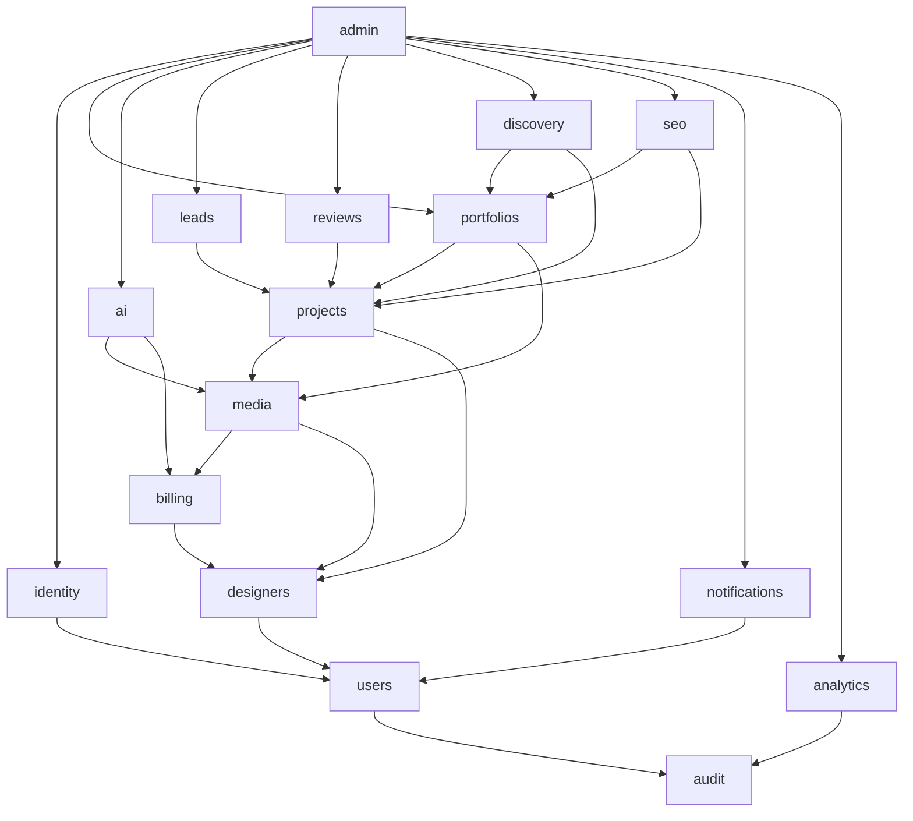
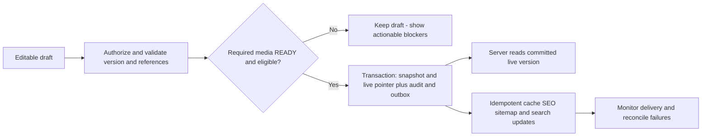

# Phase 01 — Module Boundaries

Status: selected design; no module implementation. Related: [production architecture](01_PRODUCTION_ARCHITECTURE.md), [security](01_SECURITY_ARCHITECTURE.md), [media/AI](01_MEDIA_AI_ARCHITECTURE.md). Traceability: ARCH-002–004, ROLE-004, PORT-004–005, MEDIA-001, AI-002–006, BILL-001–003, OBS-001–003. Module names are logical Java packages/library boundaries, not separately deployed services.

## 1. Layer direction

Each domain module has `api` (public Java facade/contracts), `application` (use cases/transactions/policy orchestration), `domain` (rules/value objects/state transitions), and `infrastructure` (repositories/provider adapters). HTTP controllers live at the executable composition boundary and call only application facades. Domain declares required ports; infrastructure implements them and depends inward. The runtime sequence is controller → application → domain/ports → injected adapter, but the **compile dependency is not domain → concrete infrastructure**.

No controller can call SQL, bucket SDK or AI vendor directly. No public domain API exposes JPA entities, SQL rows, Spring HTTP/session objects or SDK response classes. API DTO mapping and validation are explicit. Small kernel types are limited to opaque IDs, ActorContext, Money, clocks, event envelopes and transaction-neutral errors. A generic “shared service” dumping ground is forbidden.

## 2. Ownership and allowed synchronous calls

This table is the complete domain-level synchronous dependency allowlist. Lower layers (`kernel`, DB/outbox transport, logging adapters) are not independent business modules and never import business code. Transitive calls are possible only through facades; owning module still checks permissions. All modules may append audit records through audit's write-only contract, represented explicitly below. No module imports another module's repository or domain internals.

| Module | Owns | Allowed synchronous domain dependencies | Never owns |
|---|---|---|---|
| audit | Append-only security/business audit, restricted audit querying | none | General analytics or secret payload storage |
| users | Internal user ID, display/contact preferences, locale/timezone, deletion state | audit | Passwords, provider tokens, tenant roles |
| identity | External identity bindings, browser sessions, platform-role grants, MFA evidence, account auth state | users, audit | Studio membership, project rights |
| designers | Tenant/studio identity, memberships/scoped tenant permissions, public business data, taxonomy locations/service areas, verified-domain registry | users, audit | Credentials or plan charging |
| billing | Payment/subscription/plan/entitlement/usage/credit ledgers, reservations and verified webhook inbox | designers, audit | AI execution or project editing |
| media | Asset/variant/usage ownership, private classifications, upload lifecycle, watermark recipes, eligible publication grants, storage accounting | designers, billing, audit | Portfolio publish pointer or AI job history |
| projects | Structured project data, taxonomy relationships, revisions, real/concept associations, ownership attestation, project slug aliases | designers, media, billing, audit | Media bytes or theme layouts |
| portfolios | Sections/configuration, themes compatibility, draft/version/live pointers and tenant publication lock | designers, projects, media, billing, audit | Duplicate per-theme business models |
| ai | Jobs/attempts/lineage, references/masks, provider capabilities, share grants and later version-bound client feedback | designers, media, billing, audit | Vendor secrets in job records; real project fact authority |
| leads | Durable enquiries, contact/requirements/notes, private attachments, pipeline/follow-ups and attribution | designers, projects, media, audit | Payment settlement or marketing trackers |
| reviews | Reviews, content reports, verification evidence/decisions, appeals; V1 report foundation and V1.5 review/verification | designers, projects, users, media, audit | Unproven public trust badges |
| discovery | Rebuildable published search projection, structured filters, customer saves/collections in later scope | designers, projects, portfolios, users, audit | Editing source projects or exposing drafts |
| seo | Metadata policies, crawl eligibility, sitemap/redirect projections, SEO Center checks | designers, projects, portfolios, audit | Independent copies of private content |
| notifications | Delivery intents/templates/preferences, provider adapters, receipts and retry state | users, audit | Business decision to publish/approve/charge |
| analytics | Validated event inbox, deduplication, bounded retention and tenant aggregates | audit | Source of billing/authorization truth |
| admin | Privileged use-case orchestration and scoped operational views | identity, users, designers, portfolios, projects, media, seo, ai, discovery, leads, reviews, billing, notifications, analytics, audit | Arbitrary SQL, blanket media access or new duplicated domain rules |

Topological order: audit → users → identity/designers → billing → media → projects → portfolios/ai/leads/reviews → discovery/seo → notifications/analytics → admin. Independent modules can appear earlier than this order; every allowlisted edge points to a preceding owner. Membership authorization belongs to designers and uses authenticated ActorContext; identity does not call designers, avoiding an identity↔membership cycle. Anonymous endpoints use a public capability projection, not a fake tenant membership.

Diagram shows principal edges for readability; the table is the exhaustive allowlist and includes remaining audit/shared lower-owner calls. It is not a looser permission policy. CI will test the full table graph and Java imports using ArchUnit/package tests; adding an edge requires ADR/review and graph validation.

## 3. Dependency enforcement and data access

Start with library modules or package boundaries under one Maven reactor; a deployable per module is forbidden. Facades expose explicit names such as `MediaEligibility`, `PublishedProjects`, `MembershipPolicy`, `EntitlementReservations`. Scope includes ActorContext and TenantId; constructors are not a way to bypass policy. Runtime requests cannot construct privileged ActorContext from HTTP headers.

SQL schema ownership mirrors modules. Within one database, joins to another owner's private tables are prohibited outside owner-defined read views/migrations. Consumer projections hold only approved events/public DTOs. Migration runner has broader cross-schema privileges for explicit FK creation; runtime roles do not acquire migration power. Critical tenant FKs are allowed cross-module schemas, but deletion is coordinated through facades/events rather than cascade wiping unrelated history.

Resource-bound public reads apply live eligibility constraints. A stale search projection cannot expose a now-unpublished project: serving SQL joins a minimal live eligibility view owned by projects/portfolios/designers, not private draft tables. A future external search result must be filtered against that live gate before response, including counts where private inference is possible.

## 4. Cross-module transactions and events

Use the shared PostgreSQL transaction manager. The caller owns the outer use-case transaction; synchronous participating facades join it, do not unexpectedly commit separate transactions. Publication, required audit and outbox are atomic. No S3/SQS/AI/payment/notification HTTP calls inside a DB transaction. Long work records an intent then runs after commit.

Event envelope: eventId UUID, eventType, schemaVersion, tenantId when applicable, aggregateId, aggregateVersion, occurredAt UTC, request/trace ID, producer and minimal typed payload. Do not include tokens, original URLs, prompt text, images, phone numbers or raw provider secrets. Events in code are versioned contracts; transport uses job/event IDs and minimal routing metadata. Consumers read only owner-approved data or their own delivery intent. Sensitive payload needed for notifications is stored with restricted access in the notification intent, not copied into every event queue.

Outbox insertion is transactional; relay publishes at least once and marks dispatched only after broker acceptance. Each consumer has unique `(consumer,eventId)` deduplication and projection aggregate-version guards. Rollback never emits a successful event. Late/out-of-order events cannot rewind a live version. Different subscribers get their own durable queue or dispatch-ledger entries; **one competing-consumer queue is not a broadcast mechanism**. Startup uses outbox fan-out to media, AI, notification and projection queues without Kafka/SNS. SQL dispatch ledger tracks each intended destination independently.

| Event | Producer | Consumer action |
|---|---|---|
| UserDisabled / MembershipRevoked | identity / designers | Revoke sessions or recheck execution eligibility; no stale membership grant |
| AssetReady / AssetFailed / AssetPurged | media | Update pending job/publish readiness; no auto-publish when ready |
| ProjectPublished / ProjectUnpublished | projects | Portfolio live gate/search/SEO refresh, aggregate version dedup |
| PortfolioPublished / PortfolioUnpublished | portfolios | SEO/discovery/caching projection refresh |
| GenerationSucceeded / GenerationFailed | ai | Analytics/notifications; billing already settled atomically through facade |
| EnquiryCreated | leads | Notification intent and analytics fact; delivery failure does not delete lead |
| ConceptCommented / ConceptApproved | ai collaboration area | Scoped notifications and review history, V1.5 only |
| ReviewModerated / VerificationChanged | reviews | Public badge projection and audit; evidence never public |
| SubscriptionChanged / PaymentConfirmed | billing | Entitlement version refresh and notification; no consumer grants payment from browser return |
| DomainActivated / SlugChanged | designers / projects | Redirect/canonical/cache projection update |

Event dependencies are declared but do not create circular synchronous imports. Subscriber code lives in the consuming module and depends on immutable contract types, not producer implementation. Identity reacts to a membership event if all-session revoke is policy, but no direct compile-time call to designers is introduced. Events that are needed to deny access do not replace immediate live policy checks.

## 5. Critical use-case composition

### Portfolio publication and project changes

Portfolios owns publication coordination. Under a tenant publication lock, validate actor/membership/entitlement, draft version and theme schema; resolve exact approved project revisions; validate required public media grants; verify ownership/provenance/SEO required facts; create immutable snapshot and atomically swap live pointer plus audit/outbox. No public pointer is switched while derivatives are pending.

Project draft edits do not affect published project detail. Explicit project publication creates its own stable revision. Existing portfolio snapshots pin their selected revision; a newer project revision is available to a portfolio draft, not silently inserted into a snapshot. Show the professional “project updated; republish portfolio to update featured summary.” Canonical project detail shows its own current published revision. Public project unpublish/moderation overrides every historical portfolio reference immediately via eligibility checks. Unpublishing a portfolio hides its root but does not implicitly delete independent published project pages; an explicit **unpublish all studio work** operation hides both, and studio suspension always hides both. This behavior must be clear in later UI.

Branding/section/business presentation data is snapshotted. Global security state, domain canonical registry, verification revocation and media takedown are live overlays, not frozen authorizations. A legal/security takedown wins over historical immutability. Restoring an old version creates a new draft validated against current rules.

### AI and publication

AI job creation uses media ownership + billing reservations in one DB transaction and emits queued work. Worker uses ai facade, never directly edits billing tables. Successful output is stored privately and registered by media with provider provenance; AI success and credit settlement commit once. User attaches selected AI_CONCEPT media via project use case; projects owns the project change. AI does not call projects, and projects does not call AI: provenance/eligibility is media's common contract. Explicit publication still requires watermark and AI-label derivatives.

### Tenant deletion and reference races

Designers places tenant into DELETING and revokes membership actions in the same transaction; lifecycle coordinator in the executable layer invokes owners in reverse dependency order and emits durable cleanup jobs. It is an orchestrator, not a new business service owning everyone's tables. Row/version checks prevent a queued job recreating assets after delete. Deletion tombstones remain through backups. Jobs and purge operations lock the tenant publication/reference gate consistently before modifying publishability; a project cannot publish an asset concurrently being purged.

## 6. Provider ports, analytics and notifications

Ports: ObjectStore (media), QueueTransport (infra), ImageGenerationProvider (ai), SearchProvider (discovery), PaymentProvider (billing), IdentityProvider (identity), Email/Sms/WhatsApp/InApp providers (notifications), TelemetrySink (infra). Only adapters depend on vendor SDKs. Contract tests run against emulators/sandboxes and selected real staging services. No vendor exceptions cross the application boundary unclassified.

Analytics accepts PORTFOLIO_VIEWED, PROJECT_VIEWED, WHATSAPP_CLICKED, ENQUIRY_CREATED, PROJECT_SAVED, AI_GENERATED and QR_OPENED as versioned events. Public page views go through a bounded batch endpoint to a durable analytics queue; acknowledge202 only after accepted,503 if unavailable; browser can drop after bounded retry with an operational dropped-event metric. Business conversion facts use the transaction outbox and are not optional. Separate event tables/schema and indexes prevent page views contending with core project/billing rows. Daily aggregation and `(eventId,source)` dedup; approximate unique visitors without fingerprinting, short-lived consent-appropriate identifiers, no raw IP in product analytics. Proposed raw retention30days and aggregates13months require privacy approval before collection. Billing cost/usage is ledger-derived, never untrusted client events.

Notifications react to new enquiry/comment/approval/review/payment/verification/security events. Preferences apply to optional messages; critical security notices have a documented policy. User-facing links point to safe routes, not clean media URLs. OTP values are hashed, expire and never enter logs; dedicated sensitive templates cannot be edited as arbitrary HTML/scripts. Delivery states QUEUED/SENDING/DELIVERED/FAILED/UNKNOWN with provider receipt IDs and retry/dedup. A timeout can yield duplicate vendor delivery; reconcile where possible, use stable keys and avoid claiming exactly-once SMS/email. Official WhatsApp automation remains future scope; simple user-initiated links are V1.

## 7. Extraction criteria

Workers can scale independently by profile without extracting domain ownership. Later media/AI extraction requires an explicit service API, scoped credentials, event schema and ledger/reconciliation plan; do not let shared DB writes become permanent distributed-service coupling. Search extraction swaps a projection adapter. Analytics extraction moves its event sink/aggregates. Business permissions and authoritative ledgers remain in the monolith until a separate ADR justifies change.
