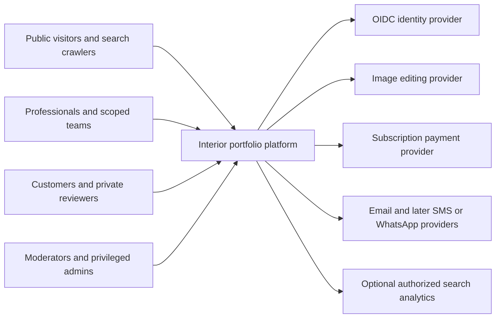
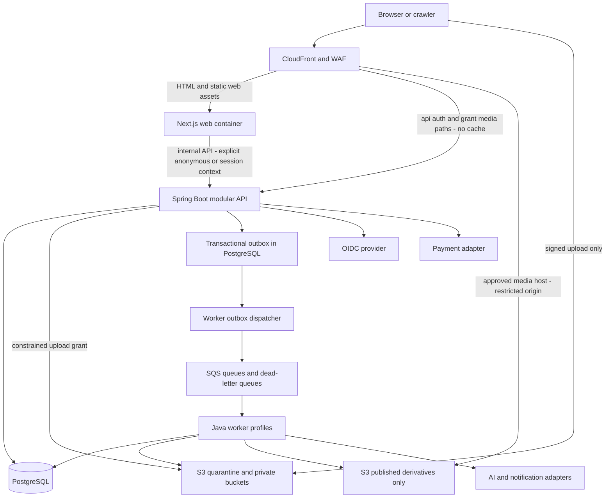

# Phase 01 — Production Architecture

Date: 2026-09-17. Status: selected architecture, not an implemented or deployed application. Product authority: [MASTER_PRODUCT_SPEC.md](MASTER_PRODUCT_SPEC.md). Traceability: [00_REQUIREMENTS_MATRIX.md](00_REQUIREMENTS_MATRIX.md). Decisions are finalized in the Phase 01 entries of [the decision log](00_ARCHITECTURE_DECISIONS.md). Read alongside [module boundaries](01_MODULE_BOUNDARIES.md), [security](01_SECURITY_ARCHITECTURE.md), [media/AI](01_MEDIA_AI_ARCHITECTURE.md), [SEO](01_SEO_RENDERING_ARCHITECTURE.md), [deployment](01_DEPLOYMENT_ARCHITECTURE.md), [testing](01_TESTING_STRATEGY.md) and [route ownership](01_ROUTE_NAMESPACE.md).

## 1. Scope and reconciliation

All six Phase 00 documents were read completely before selection. The current workspace contains those six documents and no application. This phase defines architecture; it does not repeat the audit or implement pages, templates, authentication logic, entities, migrations, image processing or AI. Only README, .gitignore and .editorconfig are added outside documentation. No empty app directories, fake build scripts, dependency installation, cloud provisioning or deployment.

No product-scope conflict was found. These differences are explicitly resolved:

- Phase 00 suggested `services/api` and `infra`; the final **proposed** monorepo uses `apps/api`, `apps/worker`, `backend/modules` and `infrastructure`. The earlier paths were recommendations, not existing code.
- Phase 01's simplified media states are a projection of the master lifecycle; `UPLOADED` corresponds to quarantine acceptance, `DELETED` to trash/purge presentation. The precise mapping is in media/AI architecture. AI API `PROCESSING` maps internal `RUNNING`; `CANCELLED` maps master `CANCELED`. RECONCILING is retained, not collapsed into failure.
- The conceptual image pipeline places a “public derivative” before watermarking. Actual unwatermarked intermediates stay private; only validated, watermarked, explicitly published derivatives become deliverable.
- Redis is evaluated, not mandatory. It is absent at startup. PostgreSQL-backed sessions and low-volume sensitive rate counters plus edge throttling meet initial needs; any later Redis cache remains disposable.
- The previous roadmap anticipated a build foundation. This narrower architecture-first instruction controls: no runnable scaffold is claimed; toolchain pins and future setup sequence are documented. Detailed schema starts only in Phase 02 after review.
- V1/V1.5/V2/Future and all six separate theme phases remain unchanged. Flags cannot silently downgrade required V1 features.

## 2. Selected stack and version evidence

Versions below are a reviewed baseline as of this date, not unbounded `latest` dependencies and not a claim that every combination was compiled locally. Before the first scaffold, resolve exact package/container digests, run compatibility checks and update this baseline if new security releases supersede it.

| Component | Selection | Reason and evidence |
|---|---|---|
| Web | Next.js **16.3.3**, App Router | Stable security-patched baseline from [official August release](https://nextjs.org/blog/august-2026-security-release); use server components by default |
| React | React/React DOM **19.3.0**, matching versions | [Official 19.3 release](https://react.dev/blog/2026/09/09/react-19-3); verify Next peer dependencies and build at scaffold gate |
| Type checking | TypeScript **6.0.3**, strict | [Official release](https://github.com/microsoft/TypeScript/releases/tag/v6.0.3). TypeScript 7 is available, but its compiler API transition can require parallel TS6 tooling; use one stable compiler initially ([Microsoft explanation](https://devblogs.microsoft.com/typescript/announcing-typescript-7-0/)) |
| Web runtime | Node.js **24.21.0 LTS** | [Official download](https://nodejs.org/en/download); LTS rather than Current. npm workspaces and committed lockfile, native JS build tooling |
| Java | Eclipse Temurin **25.0.4.1**, Java 25 LTS | [Adoptium release listing](https://adoptium.net/news?tag=release-notes); compile for Java25 without preview features |
| Backend | Spring Boot **3.4.3** (supersedes 4.1.1 baseline; runs on JDK 25 with Java 21 bytecode target) | [System requirements](https://docs.spring.io/spring-boot/system-requirements.html) Spring Framework 6.2.x with Boot BOM for managed dependencies |
| Build | Maven **3.9.16**, future checked-in wrapper | [Official Maven download](https://maven.apache.org/download.cgi); Maven native reactor, not npm driving Java dependencies |
| Database | PostgreSQL **18.6** | [Official release notes](https://www.postgresql.org/docs/release/18.6/); provider availability must be verified before provisioning, never silently downgrade |
| Migrations | Flyway versioned SQL; compatible version selected with Boot BOM at Phase02 scaffold | One global ordered migration history with module ownership; no production ORM auto-DDL |
| UI styling | CSS custom properties plus CSS Modules | No CSS runtime or Tailwind dependency is necessary to satisfy the approved “or equivalent” direction; semantic token contracts below |
| Runtime topology | AWS ECS Fargate containers; RDS PostgreSQL; S3; CloudFront; SQS Standard | Selected reference deployment, single region initially; no cloud resources created |
| Cache | CDN and immutable-version/public projection caching; no initial Redis | PostgreSQL remains authoritative; cache cannot grant permissions |
| Workers | Same Java codebase, separate worker executable/profiles; media native decoder sandbox | Avoid Python/extra application language; decoder package pin/security qualification in Phase19 |

Environment evidence: Node 22.18.0, npm 10.9.3, Java 18.0.2.1, Git 2.53.0.windows.2 were observed. Maven and Docker are not on PATH. The current Java is not the selected runtime. No runtime installation or application build took place. Security-patch and peer-dependency validation is a prerequisite to executable foundation work, not proof already obtained from documentation.

## 3. System context



Public browsing does not require identity. Teams/review/Google integrations retain approved release scopes. Arrows mean explicit interfaces, not independent internal microservices.

## 4. Container architecture and trust boundaries



The BFF is deliberately thin: `/api/v1` and `/auth` are same-origin routed to Spring. Next.js server components can call Spring over private networking; they cannot read the database or implement a second domain API. No generic open proxy to arbitrary upstream URLs. Public media never passes through Spring or Next for expensive transformations; private review media uses the authorized gateway in Spring. Only published derivatives are readable by the CDN origin identity. Browser upload access does not imply read/list rights.

Startup application deployments are web, API and worker. Worker profiles can start with one deployment but media sandbox IAM/network isolation remains mandatory; separate media and AI pools when resource or permission isolation requires it. All Java processes use the same tested domain library release and one transactional database. This is a modular monolith with asynchronous execution, not 17 network services.

## 5. Monorepo and frontend contracts

Proposed directories, created only when their first actual files exist:

```text
apps/web/                 Next.js routes and feature compositions; npm workspace
  app/(public)/          indexable server-rendered experiences
  app/(application)/     dashboard/account; authenticated, no shared cache
  app/(review)/          private previews and client grants
  app/(administration)/  admin shell; not an authorization boundary itself
  components/ui/         accessible primitives, no domain API calls
  features/              auth, designers, portfolios, projects, media, ai,
                         discovery, leads, seo, analytics, billing, reviews
  lib/                   server-only API transport and small shared utilities
  styles/                token definitions and global primitives
  config/                validated nonsecret web configuration
  tests/                 component and route integration tests
apps/api/                Spring executable: HTTP/security/composition root
apps/worker/             Spring executable: jobs/relay/composition root
backend/modules/         Java domain modules and their adapters
packages/contracts/      OpenAPI source and generated TypeScript client
infrastructure/          deployment definitions and docker/dev recipes
scripts/                 real cross-platform validation/maintenance commands
.github/workflows/       CI only once actual builds exist
docs/                    reviewed specifications and phase evidence
```

No generic `services/types/hooks` folders without use: a feature owns its hooks/view models and calls generated API clients. Generated transport DTOs are not UI view models. Share primitive UI inside `apps/web` until there is a genuine second consuming application; no premature `packages/ui`. Java reactor root `pom.xml` owns backend modules and executables. npm workspace root owns web/contracts only. Root README lists independent commands; no Nx/Turborepo/Bazel requirement. Native builds are composed in CI, not forced into one package ecosystem.

## 6. Design tokens and theme architecture

Phase04 will implement three layers: immutable **palette primitives**; **semantic aliases**; component/theme token bindings. Raw hex literals belong only in palette definitions. A lint rule prevents component literals except documented test fixtures. Platform branding cannot be altered by tenant theme configuration.

| Palette token | Value | Semantic mapping |
|---|---|---|
| charcoal | #1F1F1F | text-primary, action-dark, on-brand |
| ivory | #FAF8F5 | background |
| sage | #E7E1D8 | surface-muted |
| bronze | #B88A5A | brand, action-primary |
| forest | #2E5D4B | success |
| blue | #3E6D8C | info, accessible links |
| terracotta | #C76F4A | restrained decorative accent |
| rose | #E6C9C3 | accent-subtle background |
| white | #FFFFFF | surface |
| grey-light | #F4F4F4 | surface-neutral |
| grey-medium | #D9D9D9 | border-decorative |
| grey-dark | #6B6B6B | text-secondary on passing backgrounds |

`--color-danger`, `--color-border-control`, focus-ring and disabled/error tokens require verified combinations in Phase04; they must not be guessed from decorative tokens. Charcoal on Bronze remains 5.35:1 approximately. Contrast applies to text, controls and every state. No final CSS/design implementation here.

Also define spacing on a 4px scale, radius small/medium/large, restrained elevation levels, heading/body/label type scales with fallback metrics, reduced-motion-aware duration/easing, named z-index layers, safe-area insets and max-width containers. Layout breakpoints 768/1024/1440 px progressively enhance mobile 360–430; QA includes 360/390/430/768/1024/1440+. Type uses rem/clamp within readable bounds. Font families/license/script coverage are a Phase04 selection gate.

`PortfolioDocument` is a versioned structured DTO; `ThemeConfig` references enum BASIC/MODERN/LUXURY/ARCHITECTURAL/WARM_NATURAL/DARK_CINEMATIC, renderer version, section IDs/order/visibility, validated typography and curated palette option IDs. Registry maps theme ID to a separately implemented renderer and supported schema/options. No raw user CSS, HTML or JS; external URLs are validated data, not script snippets. Actual JSON Schema comes in Phase10.

One content schema drives genuinely distinct layouts/hero/nav/gallery/project detail/CTAs/type/spacing/motion. Common contracts enforce accessibility, provenance, media eligibility and SEO. A version includes theme renderer compatibility; a renderer upgrade must preserve old snapshots or migrate explicitly. Unsupported options produce validation errors, not dropped sections. Each theme remains an independent design/build phase11–16 and comparative QA phase17.

## 7. API and typed contracts

REST JSON under `/api/v1`. Separate anonymous `/api/v1/public`, tenant `/api/v1/tenants/{tenantId}`, self `/api/v1/me`, scoped grant and privileged `/api/v1/admin` surfaces. Resource routes never make path tenant IDs authoritative. Controllers map validated DTOs to use cases; never serialize persistence entities.

OpenAPI **3.1.0 contract-first** YAML becomes the shared wire contract in `packages/contracts`. Generate schema types with pinned openapi-typescript and consume them through typed openapi-fetch transport; generated output is read-only and reproducible. CI verifies generation/type-check/HTTP conformance. The [official typed client documentation](https://openapi-ts.dev/openapi-fetch/) explains this schema-derived transport. Java uses explicit request/response records and contract-conformance tests, not ORM DTO generation. Schema definitions include limits, nullable/optional distinctions, enum evolution and example safe errors. Additive optional changes are v1-compatible; breaking shape/semantic changes require v2 plus announced deprecation. Unknown response enum handling is deliberate; privileged request enums are strict allowlists. Static TypeScript types do not replace runtime input/output validation.

Authenticated listings use opaque keyset cursors bound to filter/sort/tenant context, default limit20/max100, deterministic ID tie-breaker, `{items,nextCursor,hasMore}`; totals optional, not always expensive counts. Public crawlable pagination uses bounded `page` links with stable ordered public results and self-canonicals. Whitelist sort fields, directions and typed filters; no raw SQL expressions. UTF-8, ISO8601 UTC event instants, opaque ID strings; return no storage keys or credential-bearing URLs except explicit private download grants.

Standard safe error envelope: `{code,message,requestId,fieldErrors:[{field,code,message}]}`. Status400 malformed,401 unauthenticated,403 authenticated forbidden action,404 missing OR inaccessible private object,409 concurrent/idempotency conflict,413 oversized,422 valid syntax but failed validation,429 throttled with Retry-After,503 temporary unavailable. Never return SQL, stack traces, provider raw errors, credentials or existence hints. Request ID generated/validated at trusted ingress; propagate trace context without trusting caller-supplied identity headers.

Mutation concurrency: version/ETag with If-Match for draft edits; return409 or412 by documented operation, not silent last-write-wins. Standardize **412 for failed If-Match**,409 for domain conflicts. Idempotency-Key required for AI job creation, upload initialization, enquiry submission and payment-initiating commands. Persist actor/tenant/operation/key plus request hash and outcome transactionally; same key/different payload409; concurrent same key cannot duplicate work. Retain API replay records at least24h; financial/job dedup keys survive longer with their durable ledger. No automatic retry of non-idempotent requests.

## 8. Database principles for Phase02

One PostgreSQL database per environment with logical module-owned schemas, `snake_case` names and tenant-qualified relationships. Use random UUIDv4 identifiers initially (vetted standard runtime generators); UUIDv7 considered but unnecessary until index locality is measured. Random IDs reduce casual enumeration, never replace authorization. Public slugs are deliberately enumerable. Public object storage keys have independent randomness.

Use `timestamptz` for instants, UTC serialization/storage convention, separate IANA business/user timezone. Project completion can be date/year precision and remains distinct from event time; follow-up appointments store instant and intended zone, not ambiguous local time. Money uses `bigint` minor units plus ISO currency; Java long/BigDecimal as appropriate and decimal-string API for integers outside JS safe range. No floating-point money. Provider cost precision may use fixed-scale decimal plus currency, separately from integer product credits. Conversion/rounding rules must be explicit per currency/provider.

Location is Country → State → City plus many-to-many service areas, stable taxonomy IDs and localized names. Public service locations/locality do not expose customer home addresses. Sensitive exact address is encrypted/restricted lead/client data, excluded from public projections and logs.

Flyway versioned SQL with checksums: never edit applied migrations. Expand/backfill/contract releases, bounded lock/statement timeouts, indexes assessed against real queries, partial live-row uniqueness where appropriate, explicit tenant prefixes on access indexes. Runtime role cannot run DDL; migration role separate. One migration deployment job runs before compatible services; rollback normally application rollback plus forward fix, not destructive down-migration. Phase02 owns actual schema/entities, not this phase.

Transactions live at use-case boundary. Same-database publication, quota reservation, sensitive audit and outbox insert commit together. No network calls inside those transactions. Pessimistic row locking or conditional updates protect quotas; consistent lock ordering and bounded retries handle conflicts. Do not require distributed transactions with S3/SQS/payment/AI. Compensating actions and reconciliation handle external side effects.

Soft-delete only recoverable user-owned content: projects/media/generations/leads can transition ACTIVE → SOFT_DELETED → PURGED with configured retention and reference rules. Users first suspended/deactivated to revoke access then deletion/export workflow; memberships revoked immediately. Immutable financial/audit records use retention/restriction/pseudonymization where lawful rather than arbitrary soft-delete flags. Exact durations require launch review; master proposals remain proposals. Purge tombstones propagate to provider, search, CDN and future backup restores.

## 9. Startup services and failure contract

SearchProvider starts as PostgreSQL indexed public read models using full-text/trigram/category/location facets, with rebuildable projections and real-vs-AI discrimination. No OpenSearch/vector database initially. Trigger dedicated search evaluation when optimized queries cannot meet p95≤300ms at representative load without harming transactional SLOs, or required multilingual/relevance features exceed PostgreSQL—not at an invented tenant count.

Payment, subscription, plan, entitlement and usage ledger are distinct billing concepts. Central `EntitlementService` exposes capability checks/reservation/settlement; no scattered `plan == PRO`. Capabilities include MAX_PROJECTS, STORAGE_BYTES, AI_CREDITS, CUSTOM_DOMAIN, ADVANCED_SEO, TEAM_MEMBERS, PREMIUM_THEME. Read caches never authorize new billable consumption without authoritative transactional enforcement.

Feature flags are versioned database configuration with audited admin edits and cached reads: AI_VISUALIZER, CUSTOM_DOMAINS, CLIENT_APPROVAL, VISUAL_SEARCH, HOMEPAGE_3D. Enforce risky flags server-side; flags are not entitlements or permissions. Unknown/missing flag off; outage uses last-known safe configuration for nonsecurity presentation only. AI kill switch blocks new submissions while reconciliation continues. No new flag vendor.

Full [failure matrix](01_DEPLOYMENT_ARCHITECTURE.md) specifies every infrastructure/provider outage. General contract: no acknowledgement before durable acceptance; authenticated/billable operations fail closed when authority is unavailable; no fallback from failed watermarks to originals; uncertain provider execution is reconciled, not blindly retried.

## 10. Cost model and architecture acceptance

Budget by measured AI attempts, original/variant GB-month, CDN GB, worker CPU-time, DB/compute hours, queue requests and notification volume. No unverified currency quotes or free-tier assumptions. Full startup/scale-up cost table is in deployment architecture. AWS operational convenience is selected with explicit fixed-cost review before launch; no Kubernetes, Kafka, always-on Redis or external search cluster.

Architecture acceptance requires: acyclic module graph; ten required threat protections; cache/tenant/origin isolation; eight meaningful Mermaid diagrams; source-backed version selection; all69 Phase01 prompt sections mapped;145 product requirement IDs retained; no implementation completion claims; documentation/foundation-only diff. Evidence and unresolved integration gates appear in [testing strategy](01_TESTING_STRATEGY.md). Stop before Phase02.
