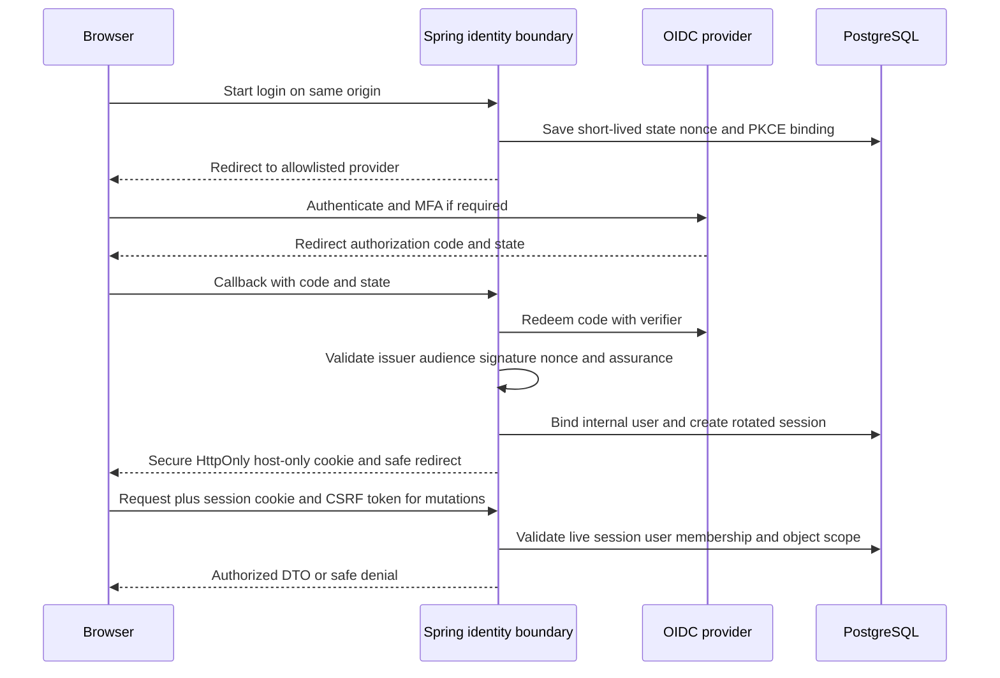

# Phase 01 — Security Architecture

Status: reviewed design, controls not yet implemented or penetration-tested. Governing requirements: ROLE-001–006, SEC-001–008, ADMIN-001–002, PRIV-001–003, COLLAB-001, WM-001–004, BILL-001–003. See [media/AI](01_MEDIA_AI_ARCHITECTURE.md), [deployment](01_DEPLOYMENT_ARCHITECTURE.md) and [testing](01_TESTING_STRATEGY.md). The remaining risks below are implementation/qualification gates, not evidence of present exploitable application code.

## 1. Trust model

Untrusted inputs include browser bodies/headers/cookies, URL slugs/tenant IDs, upload contents/filenames, AI outputs, provider callbacks, cached projections and queue payloads. Trusted authority is the verified actor plus current server-side user/membership/resource policy and authoritative database. Reverse proxy headers are accepted only from configured trusted ingress; public origins cannot be reached around it. WAF, random IDs, hidden UI and watermarks are defense layers, never authority.

Boundaries: browser→edge; edge→web/API; API→DB/storage/identity; outbox→queue→worker; worker→decoder/provider; staff→admin; tenant→tenant; public cache→private state. Every boundary has explicit identity, permitted data and failure behavior. Original/reference bytes never enter public web caches or frontend build artifacts.

## 2. Authentication selection

**Managed standards-based OIDC authentication, backend-owned opaque browser sessions.** Identity vendor is selected in Phase03 against email recovery/verification, MFA, revocation/webhooks, region, exportability and cost requirements. OIDC protocol/session architecture is final now; vendor choice is not necessary for domain schema. No password implementation is authorized in Phase01. Managed identity keeps password hashing/reset inside a vetted provider; if a later decision self-hosts credentials, it requires a new ADR and adaptive hashing/recovery/security tests, not a quiet substitution.

Use authorization code with PKCE, state and nonce. Backend validates issuer/audience/signature/time/nonce and maps `(issuer,subject)` to internal user. An email claim alone must not merge accounts. OIDC refresh/access tokens needed by the server stay encrypted in restricted storage with encryption keys in secret management, never browser storage. Use refresh rotation/reuse handling if the provider offers refresh tokens; otherwise short-lived server reauthentication flow. Our browser protocol has **no JS-accessible access/refresh JWT pair**. Future API/native clients may use short-lived audience-scoped OAuth access tokens and rotated refresh tokens in platform secure storage, with the same backend resource policy.

Proposed concrete session policy (configurable with reviewed changes): random256-bit token; store only its cryptographic hash; `__Host-session`, Secure, HttpOnly, Path=/, no Domain, SameSite=Lax. Normal session idle30min, absolute12h; no persistent remember-me initially. Rotate on login, step-up and privilege change. Session rows are authoritative in PostgreSQL, not an in-memory per-replica map. Device/session management exposes safe device labels/recent activity and per-device/all-device revoke; never display raw tokens or detailed full IP history. Last-seen updates are throttled to avoid per-request write load while validity is checked per protected request.

Logout is CSRF-protected POST, deletes server session and clears cookie; provider logout is attempted through validated endpoint but local logout succeeds even if provider is unavailable. Reset/recovery, verified-email changes, suspension and security-role changes revoke sessions via authenticated provider event or application operation. Provider revocation-event loss is covered by periodic reconciliation and bounded session lifetimes; revoke-on-recovery capability is a vendor gate. Phone ownership verification is a distinct OTP action when needed; not automatically equivalent to business identity verification.

CSRF: synchronizer token associated with session, returned by a no-store endpoint and submitted as header on all cookie-authenticated mutations, including logout. Check exact Origin/Referer where available and Fetch Metadata as additional defenses, never solely SameSite. GET has no mutations. Pre-login sensitive actions use same-origin anti-CSRF/one-time binding as applicable; OAuth callback is protected by state/PKCE/nonce, not an arbitrary blanket CSRF exception. Only verified webhook routes use provider authentication instead of cookie CSRF.

Next server components forward only the application's session cookie to a fixed internal API origin for private rendering; public rendering explicitly omits it. Responses containing personalized data are `private,no-store` at every layer. Internal web workload identity proves caller service, not end-user privilege.

## 3. Authorization and tenant scoping

Roles PUBLIC (anonymous context), CUSTOMER, DESIGNER, DESIGNER_TEAM, MODERATOR, ADMIN and SUPER_ADMIN are not sufficient on their own. Policy evaluates `(actor, platform role, active tenant membership, action permission, resource tenant/owner, classification, state, entitlement)` per operation. A customer who is also a studio member does not gain access to other customers' enquiries.

Controller establishes verified ActorContext. Application facade calls owning policy; repository queries include `tenant_id AND resource_id` and any owner predicates; foreign keys/uniqueness preserve tenant relationships. Return404 for another tenant's private ID to avoid existence disclosure. Nested asset/reference IDs are independently validated, not trusted because the parent project is authorized. UUIDs are not access tokens. Batch operations reject or individually authorize every item; totals/filters/suggestions cannot expose private tenant data.

PostgreSQL **RLS is selected as defense in depth for tenant-private tables** in Phase02/03, alongside application checks. Runtime roles do not own tables, have no BYPASSRLS and use FORCE ROW LEVEL SECURITY where applicable. Trusted transaction-local context (`SET LOCAL` through parameter-safe mechanism) is set only after membership validation; missing context denies. Connection pooling tests prove context disappears after commit/rollback/error. Worker jobs establish system-purpose plus tenant context and recheck relevant current state. Minimal published read views/roles are explicitly allowed public projection access, not a blanket superuser workaround. Migration/backup identities are separate and must prove complete backups without silently filtering rows. RLS is not a defense against an app capable of arbitrarily setting an attacker-chosen trusted context; application checks and SQL-injection prevention remain essential.

Cross-tenant staff access uses explicit case/purpose-scoped admin use cases and separate narrowly scoped DB access contracts. Do not grant the general API worker role BYPASSRLS to make admin queries easier. Dashboard membership selection is user convenience, not authority. Changing URL/header/session tenant cannot bypass membership. Revocation applies at execution time for queued mutations; retention/reconciliation jobs use narrowly defined system authority rather than indefinitely borrowing a revoked user's authority.

## 4. Privileged access

Admin/moderator routes and API actions have a distinct security policy. Mandatory MFA for privileged users before production; prefer phishing-resistant WebAuthn where provider supports it and validated TOTP fallback. SMS alone is not the admin MFA baseline. Verify authentication assurance (`acr`/`amr` or equivalent validated provider evidence), not a frontend flag.

Admin session idle15min/absolute4h; step-up within5min for grants, billing adjustment, suspension, sensitive evidence/private-media inspection, verification override or destructive moderation. Maintain separate assurance on the session; ordinary designer login cannot silently become admin. SUPER_ADMIN is a restricted emergency/role-governance account, never daily operations. Recovery codes protected/one-use, auditable break-glass procedure, alerts for privilege changes/failed MFA/recovery. Sensitive actions require reason, target, permission and immutable audit in the same transaction. No unrestricted impersonation endpoint.

## 5. Endpoint-aware rate limits

Initial safety defaults below are architecture starting values, configurable and tuned with real traffic; they are not finalized commercial quotas. Enforce combinations, not only a spoofable client IP. Parse IP solely from trusted ingress; privacy-safe keyed hashes for limiter keys. Distributed correctness uses short-window PostgreSQL atomic counters for low-volume sensitive actions and edge coarse IP controls; Redis is optional later, not required for correctness.

| Operation | Initial bucket strategy | Failure behavior |
|---|---|---|
| Login starts/callback failures | 10 failures/15min per identity hash plus30/IP/15min; progressive cooldown | Generic response; do not permanently lock victims from unauthenticated traffic |
| Password reset | 3/account/hour plus10/IP/hour | Generic accepted wording regardless of account existence |
| Phone/email OTP send | 3/destination/15min,10/day; verify5/code before invalidation | Prevent resend bypass; short expiry; no OTP in logs |
| Admin login | 5 failures/15min per account and10/IP; alert | Fail closed if authoritative limiter unavailable |
| AI creation | 5/min/member plus tenant concurrency default2; authoritative credit/plan limits separately | 429/Retry-After; no queueing or charging on denial |
| Upload initialization | 30/min/member, tenant pending-byte quota; batch grants bounded | Reject before grants; actual uploaded bytes checked later |
| Enquiry | 3/10min per contact hash+studio,10/IP/10min; progressive challenge | Protect shared mobile networks without IP-only permanent bans |
| Public search | 60/IP/min edge, bounded query length/filter/count and API concurrency | 429; expensive queries shed before DB overload |
| Grant review/media | Token+IP windows and per-grant concurrency; abusive reads throttled | No existence hints; revoked token denied regardless of limiter cache |

On PostgreSQL outage protected/billable mutations already fail503. If an optional Redis limiter is later introduced and unavailable, sensitive endpoints fall back to bounded authoritative counters or503, never unlimited fail-open. Public cached read availability may continue with edge limits. No lock stored solely in Redis guards money or publication.

## 6. Upload, storage, share and provider defenses

Upload policy uses authenticated and scoped initialization, private quarantine, bounded bytes/pixels/frames, extension allowlist plus MIME/magic/content checks, patched decoder sandbox, metadata stripping and server-generated key. No executable upload, active SVG markup or arbitrary URL fetch. Sandbox has no network/credentials and CPU/memory/time/disk limits. Malicious inputs fail, not become public on exception. Detailed grants/limits and processing states: [media/AI architecture](01_MEDIA_AI_ARCHITECTURE.md).

Private originals, references, masks, inputs, outputs and review assets have no CDN origin read permission. Signed owner download grants are short-lived (≤60s default) and auditable; share media uses a live grant-checking gateway for immediate subsequent-request revocation. Already downloaded bytes cannot be recalled. Watermark presence never upgrades visibility. Explicit public release must authorize classification, provenance and derivative status.

Private share tokens: high-entropy, hashed at rest, limited concept/version/action, expiry, revocation and optionally recipient verification. Initial link exchanges token for a host-only review session then redirects to a clean URL where feasible; scrub token paths in ingress/access logs from the start. No third-party scripts on review/preview pages. Provider inputs supplied server-to-server as bytes or minimal short-lived purpose-bound access where required; never public reference URLs. Provider result downloads allowlist known hosts, block private/link-local/metadata IPs after DNS resolution and redirects, and cap bytes/time. Output is untrusted media processed through the normal validation pipeline.

## 7. Headers, browser policy and secret handling

Production baseline: HSTS with gradual validated rollout; includeSubDomains/preload only on platform-controlled zones after inventory, never blindly on customer domains. `X-Content-Type-Options: nosniff`; Referrer-Policy `strict-origin-when-cross-origin` on public pages and `no-referrer` for auth/share/preview/admin. Permissions-Policy denies camera/microphone/geolocation by default; camera use for uploads requires a documented user-facing workflow/allowlist, not global access. Frame policy `frame-ancestors 'none'` and `X-Frame-Options: DENY` unless a reviewed embed product is later introduced.

CSP starts Report-Only in staging, enforced before production: default-src self; object-src none; base-uri self; frame-ancestors none; form-action self plus exact selected checkout/identity requirements; scripts use nonce/hash policies without `unsafe-eval`; images/media allow self and exact derivative host plus deliberate blob preview support; connect-src self and exact approved telemetry/provider-browser endpoints. **AI providers are server-side and need no browser CSP allowance.** Payment scripts/frames, if required, appear only on billing routes with explicit vendor origins; no `*`. Fonts self-hosted if licensed. Styles follow Next-compatible nonce/hash or reviewed static policy; no blanket arbitrary designer styles. Nonces require response-specific rendering and cannot be reused in shared cached HTML. Public SSR/no-shared-HTML-cache baseline avoids that conflict; a future cached HTML/hash solution needs separate validation.

Strict CORS: production same-origin browser APIs, no wildcard credentialed origins. Signed upload bucket CORS only platform app origin and required methods/headers. Custom-domain public portfolios do not get platform session cookies; contact posting uses domain-bound public endpoint controls, not permissive cookie access. Unknown Host/X-Forwarded-Host rejected before tenant/cache resolution.

Secret values never in frontend env, source/README, job rows, logs, artifacts or error payloads. Workload identity/task roles preferred over static cloud keys. Separate per-env IAM/secret namespaces and encryption keys; rotation and revocation runbooks. Only nonsecret public configuration uses `NEXT_PUBLIC_` prefix. CI uses short-lived OIDC deployment credentials; PRs from forks receive no environment secrets. Redact cookies/Authorization/tokens/signed URLs/prompts/household data from logs at source, not only at log UI.

## 8. Payment/webhook and audit safety

Do not grant subscription/credit from checkout redirects, browser amounts or unsigned callbacks. Payment adapter validates provider signature against raw body, expected account/env, timestamp/replay defenses when supported and authoritative server lookup where needed. Unique provider event ID inbox prevents duplicate processing; transactions apply allowed state transitions and ledger entries once. If DB cannot durably accept a webhook, return retryable failure, not200. Amount/currency/tenant/subscription mapping must match server records; partial refunds/disputes are explicit ledger adjustments. Provider secrets are secret-manager references, never DB secret values.

Audit sensitive operations: verification changes, admin user edits, billing adjustments, account suspension, project moderation, role/security changes, share grant changes and private access grants. Record actor, tenant, action, target, reason, result, UTC time and request/job ID; safe before/after identifiers/diffs only. Runtime roles can append but not update/delete audit rows; audit reads require permission. Protected export to separate storage plus integrity verification supports tamper evidence. A DB administrator can still alter data unless external integrity controls are used; do not promise absolute immutability from application permissions. No failure of required audit persistence may silently allow a sensitive mutation.

## 9. Architecture security review

| Threat | Selected prevention | Required later evidence | Phase / residual risk |
|---|---|---|---|
| IDOR/BOLA and insecure direct object access | Actor/action/tenant/object checks, scoped repositories and RLS | Swap IDs in paths, nested bodies, batches, grants, cursor and download routes | 02–03 and every feature; R-11 HIGH/CRITICAL until tested |
| Cross-tenant access via workers/caches | Job tenant context, purpose checks, cache keys, published read gates | Two-tenant jobs, revoked membership, pooled connection reset and host poisoning | 03/19/21/29; R-11 |
| Public original exposure | Separate private buckets/IAM; CDN cannot read originals; optimizer cannot fetch them | Direct S3/CDN/guessed key/Next optimizer bypass attempts | 19; R-22 HIGH |
| AI reference exposure | Private classification, provider purpose grants, no logs/client URLs | Reference ID substitution and signed-link/log inspection | 21–23; R-25 HIGH |
| Admin escalation | Validated MFA assurance, independent policies, deny editable-role fields, step-up/audit | Designer→admin mutation, role replay, recovery bypass, admin session expiry | 03/07/29; R-10 HIGH |
| Upload abuse | Private quarantine, content-aware checks and networkless decoder sandbox | Polyglots, bombs, malformed formats, excessive frames, SSRF results | 19; R-08 CRITICAL |
| Secret leakage | Secret manager/workload identity, safe env classification and redaction | Repo/artifact/log scans and browser bundle inspection | 03/29; R-31 HIGH |
| Payment spoofing | Server authority and ledger reconciliation | Fake return URL, altered price/currency, replay/refund concurrency | 28; R-17 HIGH |
| Webhook spoofing | Raw-body verification, scoped account, event inbox and state guards | Invalid/missing signature, wrong env/account, duplicate/out-of-order events | 21/28; R-17 HIGH |
| Share token replay after revoke | Live gateway policy, hashed scoped grant, no-store | Token/session/media requests after revoke/expiry and version replacement | 24; R-24 HIGH |

Additional required tests include CSRF, stored/reflected XSS in portfolio text/theme settings, SQL-injection payloads, rate-limit bypass, public cache contamination, dependency/SAST/secret scans and deletion/restore privacy. These controls are reviewed for architectural coverage only; no exploit tests ran against absent software.

Remaining high risks: identity provider assurance/revocation must be proven in03; RLS/pool context in02/03; CDN takedown and IAM isolation in19/20; hostile decoder processing in19; unknown AI execution/cost and data retention in21; webhook/ledger races in28; full restore and incident response in29. None requires changing the selected architecture before Phase02, but each blocks its dependent public/paid launch.
