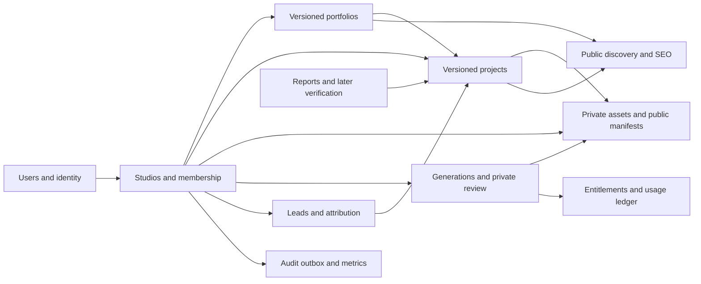
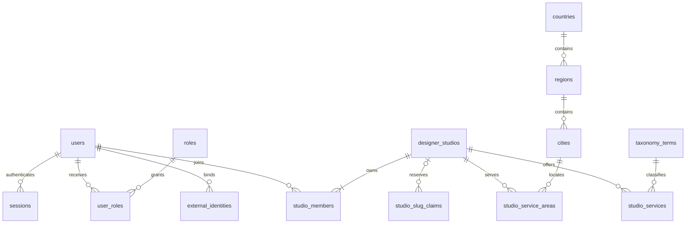
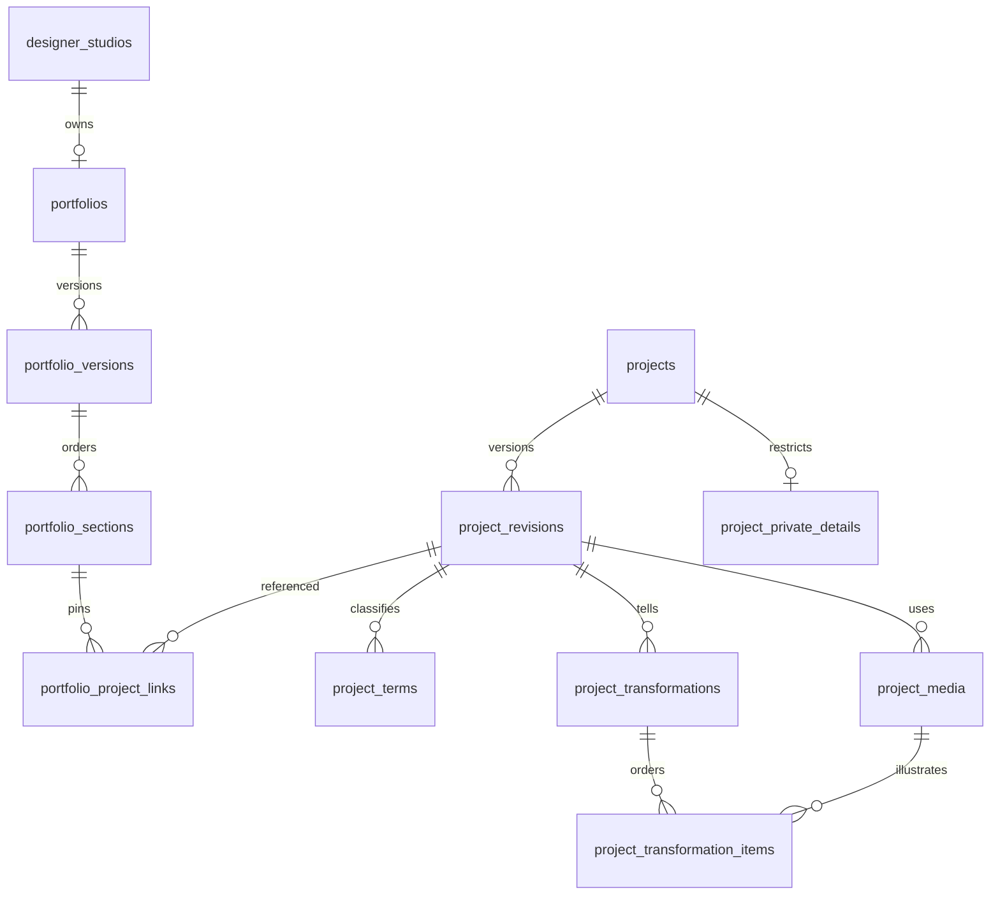
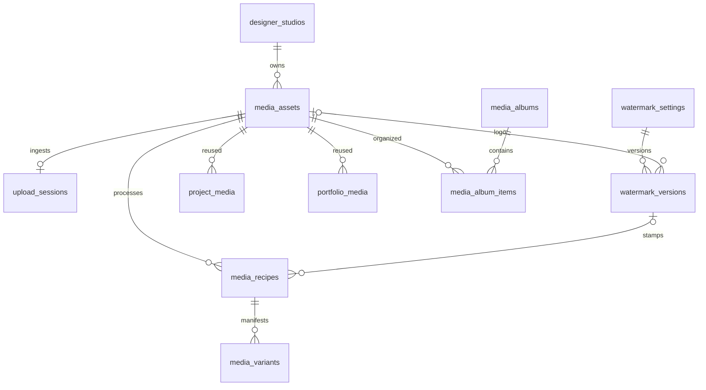
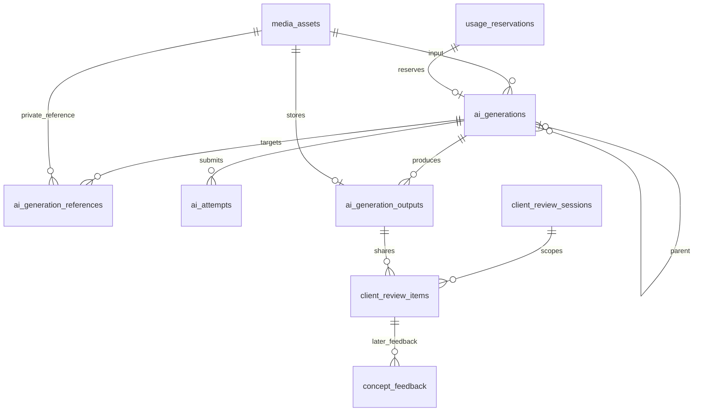
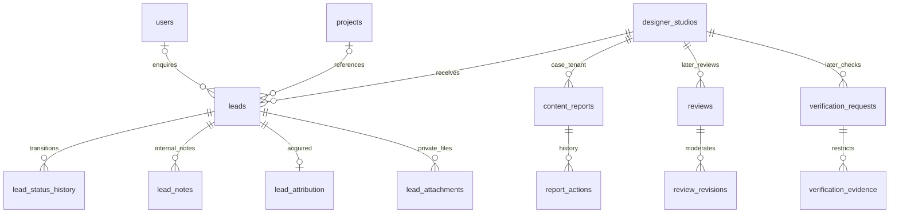
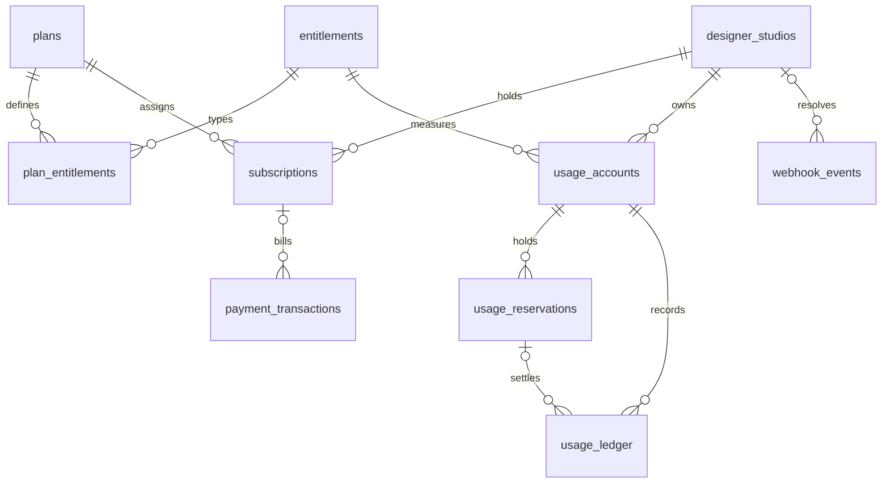
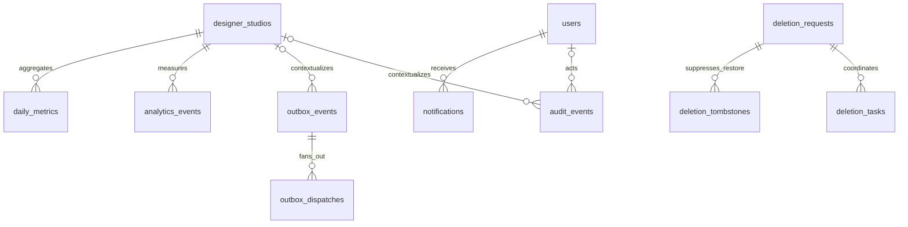

# Phase 02 — Domain Model

2026-09-17 • Architecture blueprint, not implemented functionality. Authority: [master specification](MASTER_PRODUCT_SPEC.md). The fourteen required prior documents were reviewed in full. [Schema dictionary](02_DATABASE_SCHEMA.md) defines 94 tables (84 V1, 10 deferred V1.5); [security](02_DATA_OWNERSHIP_SECURITY.md), [lifecycles](02_ENTITY_LIFECYCLES.md), [taxonomy](02_TAXONOMY_STRATEGY.md), [query strategy](02_INDEX_QUERY_STRATEGY.md), [migration plan](02_MIGRATION_STRATEGY.md) complete the design.

## 1. Reconciliation with approved architecture

The modular monolith, PostgreSQL18.x, Flyway, module-owned schemas, tenant FKs, immutable published snapshots, private originals, separate Java workers, outbox, SQS and release boundaries remain unchanged. No application scaffold, UI, integrations, payment processing or executable migration is introduced.

Three explicit refinements:

1. **UUIDv7 replaces ADR-023's UUIDv4 default under this phase's express preference**, recorded in ADR-037. PostgreSQL18 supplies uuidv7() natively; Java can carry its UUID value without a special generator library. Generate with INSERT RETURNING, or SELECT uuidv7() in the same database transaction before inserting a graph. No measured speedup is claimed. v7 exposes approximate creation time and is not a secret; independent random256-bit share/session tokens remain mandatory. v4 was simpler across older databases and conceals time; that compatibility advantage is unnecessary for the selected PostgreSQL18 deployment. Distributed workers obtain IDs from the authoritative DB, do not implement home-grown clock counters. No integer API IDs. Existing v4 reference fixtures would remain valid. [PostgreSQL UUID functions](https://www.postgresql.org/docs/18/functions-uuid.html).
2. Canonical AI storage state is **RECONCILIATION_REQUIRED**, replacing Phase01 RECONCILING as spelling only; RUNNING becomes PROCESSING and CANCELED becomes CANCELLED. CREATED/RESERVED are atomic submission steps, not externally visible successful job states. No provider uncertainty or credit rules are dropped; ADR-043 records the mapping.
3. The earlier roadmap's executable-migration expectation is narrowed by the current explicit blueprint-only instruction. Dictionary, constraints and implementation test plan are the Phase02 deliverable. No migration/SQL execution is claimed. Phase00/01 reports remain historical; Phase02 is completed for review, Phase03 not started.

No other architecture contradiction was found. DB FK dependencies can be cyclic for version pointers; that does not create cyclic Java calls. The Phase01 16-module facade allowlist is preserved. AI does not query/call projects: a generation's optional project context is represented by later attachment of its output media to a project revision, not an AI-owned project FK requiring an unauthorized facade call.

## 2. Aggregate ownership and invariants

| Aggregate / purpose | Owner and major entities | Lifecycle | Invariants / cross-module contracts |
|---|---|---|---|
| Person / authentication | users owns users; identity owns external_identities, roles, user_roles, sessions, login_transactions, rate_limit_buckets | Pending/active/suspended/deactivated; sessions expire/revoke | Internal person ID independent of issuer/subject; unique binding; no password or provider secret; many platform roles. Identity calls users/audit only |
| Studio / team | designers owns designer_studios, studio_members, contacts, services, service areas, studio_slug_claims | Pending/active/suspended/deleting/deleted | Studio owns business resources; no sole owner_user_id shortcut. At least one active OWNER while operable. Owner transfer adds/reassigns before revocation in locked transaction. Future invitations create no authority before acceptance |
| Taxonomy / geography | designers owns taxonomy_terms, countries, regions, cities | Active/retired | Typed lookups and parent geography; never repurpose code; private exact address excluded. Consumer FKs validated by kind |
| Portfolio / sections | portfolios owns root, versions, sections, project links, media usages, preview grants | Mutable draft; sealed published/archived revisions | One root/studio, one draft, one current published; all six renderers share one schema; exact project revision pins. Calls designers/projects/media/billing/audit |
| Project / story | projects owns root/revisions, terms, media, transformations/items, private details, slug claims, attestations | Draft/ready/published/archived plus trash | Facts/media association belong to revision; private address outside snapshot. Real/concept provenance cannot be changed by assigning COVER/AFTER. Calls designers/media/billing/audit |
| Media / recipe | media owns assets, upload sessions, recipes/variants/jobs, albums/tags, watermark versions | Upload/quarantine/validate/process/ready; failure/trash/purge | Original always private; validated asset isn't published; immutable source/version/checksum. First-class usage is typed consumer joins, not unsafe generic owner_type/owner_id. Calls designers/billing/audit |
| Generation / share | ai owns generations, references, outputs, attempts, callbacks, review sessions/items; feedback later | Queue/process/reconcile/success/failure/cancel | Same-tenant READY private sources; request immutable once queued; child lineage, multiple outputs; durable submission intent before external call. Calls designers/media/billing/audit |
| Lead | leads owns enquiry, history, notes, attribution, attachments | Eight CRM states plus recoverable trash | Durable before success response, history in same transaction, customer projection omits private notes. Assign only active studio member. Calls designers/projects/media/audit |
| Trust / moderation | reviews owns V1 reports/actions; V1.5 reviews/revisions/dimensions/verification/evidence | Moderation and verification independent of publication | Typed target FKs, private evidence, audit-required decisions; no inferred badge. Calls designers/projects/users/media/audit |
| Discovery / collections | discovery owns published project/studio search projections; later collections/items/grants | Rebuildable projection; private customer collection lifecycle | Serve-time live source eligibility including counts; saved private interests never studio-owned by project relationship. Calls approved source facades/users/audit |
| SEO | seo owns curated landing_pages and rendering/index rules | Draft/published/archived with quality eligibility | SEO fields live with their portfolio/project revision; common validated value object, not duplicated entity EAV table. Canonical is derived from owned slug/domain registry, no arbitrary canonical override |
| Billing / entitlements | billing owns plans, entitlement values, subscription assignments, usage accounts/reservations/ledger, transactions/webhook inbox | Subscription and payment states; immutable accounting | Capability codes, never plan-name conditionals. No float money; holds and postings once; provider cost separate from user credits. Calls designers/audit only |
| Notifications | notifications owns notifications/preferences/delivery_intents | Queued/sending/delivered/failed/unknown | Private delivery data separate from safe in-app message; intent survives provider outage. Event handlers, not synchronous leads→notifications imports |
| Analytics | analytics owns bounded events/daily_metrics | Accept/dedup/aggregate/expire | Pseudonymous minimal inputs, not billing truth; business facts through outbox. No unlimited raw warehouse |
| Audit / infrastructure records | audit owns audit_events plus physically grouped outbox/dispatch/receipts/idempotency/deletion records | Append/dispatch/retain; deletion workflow | Infra envelope tables are not business audit events; each owner appends via shared infrastructure. Runtime cannot edit audit/ledger history |
| Admin / config | admin owns access_cases/feature_flags; orchestrates scoped owner facades | Expiring case grants; versioned config | No generic database console or blanket tenant bypass; step-up + reason + audit. Flags never grant permissions |

V1.5 tables are exactly: ai.concept_feedback; reviews.reviews, review_revisions, review_dimensions, verification_requests, verification_evidence; discovery.collections, collection_items, collection_grants; designers.custom_domains. They are not part of the first security migration.

## 3. Content model: hybrid normalized references plus validated JSON

Root rows carry tenant/lifecycle/live pointers, not every content section. portfolio_versions contain controlled theme configuration and a small published business presentation snapshot; portfolio_sections carry ordered typed content blocks. Assets and project revisions are **relational FKs**, never UUIDs hidden inside JSON or arrays of image URLs. Project facts, taxonomies, budgets, media and transformations are normalized revision-owned rows.

All six theme IDs BASIC, MODERN, LUXURY, ARCHITECTURAL, WARM_NATURAL, DARK_CINEMATIC select application-registered renderers. No six content copies or theme-specific authorization. Theme switch creates/updates draft config and validates capabilities; unsupported settings cause actionable validation, never data loss.

Proposed application contracts, implemented in Phase10:

| Document | Shape and constraints |
|---|---|
| theme_config v1 | Object with only palette_option, typography_option, button_style, hero_layout and supported motion option IDs; additionalProperties=false; max8KiB; choices come from selected theme registry. No CSS/JS/HTML/font URL |
| business_snapshot v1 | Approved business_name, description, business type label/code, experience facts, locale/timezone, contact objects and public service-area/service labels; max32KiB; no user email copied implicitly, private address, membership or verification claims |
| section.content v1 | Discriminated by registered section type; prose plain text or bounded safe rich-text AST (paragraph/list/emphasis/link only); references through relational slots. FAQ pairs, process steps, awards, authored testimonials and team presentation entries bounded at20 items/type; teams here are public biographies, not authorization memberships |
| section.settings v1 | Presentation enums and visibility; max4KiB; position is relational; unsupported key rejected |
| crop v1 | Oriented source x,y,width,height normalized decimals, each0..1, nonempty rectangle inside source; no executable expression |
| AI parameters v1 | Adapter capability-approved numeric/enum values, seed if supported, declared precedence policy; max8KiB; never API credentials or arbitrary vendor response |
| recipe.required_variants v1 | Finite unique size/type/format tuples for image or qualified video recipe, max32 tuples; file identities remain variant rows |
| other JSON | Each table's named schema/version and bounded fields; logs/events IDs and safe enums, never prompts/PII. Plan allowlists are bounded capability enums |

Section registry includes HERO, ABOUT, FEATURED_PROJECTS, PROJECT_GRID, SERVICES, BEFORE_AFTER, TRANSFORMATION, VIDEO, STATISTICS, PROCESS, TESTIMONIALS, REVIEWS, TEAM, AWARDS, SERVICE_AREAS, FAQ, CONTACT, SOCIAL, CTA. Initial maximum30 sections/version,64KiB content/section,512KiB total authored portfolio version including business/theme/sections (proposed safety bounds, not pricing). Public mobile DTOs paginate content/media; that ceiling is not a mandatory response payload. V1.5 review widgets do not make V1 authored testimonials falsely verified. AI suggested content requires explicit human confirmation in later assistant workflow.

Every write validates schema; publication revalidates entire graph with current eligibility. Old sealed schemas remain readable by compatible renderer or explicit migration adapter. Restore copies old content into a **new** DRAFT with a new version number, validates/migrates, never edits historical payload. Snapshots may contain intentional denormalized display labels; domain IDs/ownership remain normalized.

Portfolio publication seals existing DRAFT and child rows, archives previous live version, sets pointers and creates fresh draft copy in one transaction. Archived published revisions remain valid pins while their project root remains eligible. Preview grant stores draft's optimistic bound_version; editing invalidates that preview until a fresh grant is issued. No apparent immutable preview silently follows changing content.

Portfolio-only photographs (hero, team or editorial images outside a project) require the same rights confirmation. Its required PORTFOLIO_PUBLISHED audit event records actor, exact portfolio version, statement_version and confirmation outcome as a typed safe payload. Project photographs additionally have publication_attestations. No portfolio image can bypass attestation because it lacks a project row.

## 4. Media usage, privacy and watermark model

MediaUsage is a domain contract implemented by typed joins: project_media, portfolio_media, version logo/favicon FKs, AI input/mask FKs, ai_generation_references, outputs, lead_attachments and later verification_evidence. A read-only media usage view can UNION those owner-approved references for accounting/purge; it is not an extra counted table. Avoid a generic polymorphic association whose parent cannot be constrained. Duplicate association rows across immutable revisions are intentional; original object bytes are reused once. FK references also include watermark logos, recipes and grants during reference-aware deletion.

Classification mapping:

| Required label | Representation |
|---|---|
| REAL_PROJECT | asset.provenance=REAL, photographic content kind |
| BEFORE / AFTER | project_media role and transformation stage, validated REAL provenance |
| AI_CONCEPT | AI_GENERATED provenance; concept usage/stage; label policy |
| AI_INPUT | generation input FK, private provider input variant |
| REFERENCE_COLOUR / MATERIAL / HANDLE / DESIGN | typed reference row; asset REFERENCE provenance and private_only=true |
| CLIENT_PRIVATE | private-only asset or PRIVATE/CLIENT_SHARED usage, bounded grant |
| PORTFOLIO_PUBLIC | explicit live portfolio/project usage; eligible public manifest, not original privacy |
| LOGO | BRAND provenance and named version/logo role |
| COVER | project_media COVER usage; does not change asset provenance/privacy |

Every original lives only in quarantine/private master storage. asset.private_only denies even derivative publication for references, masks, verification evidence and client-only inputs. A normal original may be explicitly authorized for derivative publication; its own bytes remain private. Using a project photo as input does not revoke its separately authorized public photo usage. Reference/evidence assets cannot be laundered by assigning COVER; attach-as-reference should create a private semantic asset if the original is otherwise public-authorized. No cross-tenant asset reuse.

Publication can use active_public_recipe only after explicit owner permission, READY assets/variants, valid rights attestation and a live published usage. Manifest READY by itself gives no CDN availability. Public materialization copies only approved bytes into derivative zone after these checks; loss of final live usage triggers origin removal/invalidation. Availability survives another usage being removed only when another authorized live usage actually exists.

Watermark_settings points to desired immutable watermark_versions. Version pins immutable logo asset, business name, mode, position, opacity, scale and style version. Initial database visibility bounds are opacity0.350–1.000 and scale0.050–0.300; Phase19 must qualify per-size legibility and may tighten by reviewed migration. Five supported positions remain BOTTOM_RIGHT/BOTTOM_LEFT/TOP_RIGHT/CENTER/TILED. No enabled=false public bypass. Logo failure uses visible business name.

media_recipes pins asset checksum through immutable source, processing version, watermark version, crop and AI-label version; recipe hash includes full manifest parameters. media_variants records actual objects and stamp verification. Change logo/settings → new config/recipe/objects → verify full manifest → atomically replace active_public_recipe under studio lock. Old recipe stays watermarked while pending; no master overwrite. Logos/favicons are BRAND exceptions to double stamping, never a way to classify a project photograph as a logo. Thumbnails, covers, OG, video poster and future exports all use this contract; video watermark/transcode specifics must be qualified before enabling video public delivery.

## 5. AI, references, ledger and transformation example

One generation G2 can reference input photograph A, a normalized mask M, COLOUR blue reference R1 targeting upper cupboards, COLOUR white reference R2 targeting lower cupboards, and HANDLE silver reference R3 targeting all handles. Reference uniqueness is generation+position, **not generation+type**. Checksums pin exact bytes. Mask records dimensions, input checksum, mask checksum, explicit WHITE_EDIT/BLACK_EDIT/ALPHA_EDIT convention and coordinate schema; decoder/orientation matching tested before submit. Parameters record explicit conflict/precedence decision; provider cannot silently ignore an unsupported request.

G1 produces output O1; G2.parent_generation_id=G1 produces O2 and O3. Parent only points backward to existing same-tenant generation, immutable after creation; no reparenting cycle. An output never overwrites another. selected is a studio choice, not client approval. Project revision P has one transformation T with BEFORE A, AI_CONCEPT O1, AI_CONCEPT O2, AFTER real photo Z. Typed output asset provenance connects AI history without projects querying AI internals. Client review session S includes exact O2; V1.5 APPROVE feedback references that immutable review item. To show approval alongside a private story, composition obtains approval from AI facade separately; public story never leaks reviewer identity or treats approval as proof of construction. New O3 requires new inclusion/approval.

Usage accounts separate lifetime occupancy (storage/project/seat units) from period credits. For occupancy, available=max(0,limit_units-consumed_units-reserved_units). For credits, available=max(0,granted_units-consumed_units-reserved_units), and granted units derive only from authorized plan period/credit grant entries. Checked bigint arithmetic, no negative balances. Period key is unique; renewal grants have stable operation keys; an existing hold remains on its original account across renewal/downgrade.

Ledger equations: GRANT adds granted_delta; RESERVE adds reserved_delta=u; CONSUME decreases reserved by held amount and increases consumed by actual units (<=hold); RELEASE decreases reserved by hold; REFUND decreases consumed by eligible previously consumed amount; occupancy deletion is a reasoned release-of-consumption adjustment. Counter changes and append ledger entry happen together under account lock. Refund totals cannot exceed referenced charge/consumption; lock original entry, require same account, track prior adjustments. Adjustment entries require staff reason/audit. Drift detection compares SUM(deltas) with account counters; repair is audited, never silent overwrite.

AI job+credit hold+outbox commit together. Before network call, durable attempt/submission_key/intent recorded and fenced. Provider timeout or worker death after intent → RECONCILIATION_REQUIRED, including when no provider request ID was returned. No expiry-based refund/retry of possibly accepted work. Provider receipt/callback/poll/manual evidence resolves uncertainty. Validated durable output+success+consume once in one DB transaction; vendor cost separately recorded numeric(20,8)+currency. Vendor-charged unusable output remains platform cost under Phase01 policy. Cancel after submission means cancel_requested then reconciliation; it cannot imply refund. Operational24h reconciliation target is an alert, not automatic resolution.

## 6. Exact transaction boundaries and lock order

Consistent order when needed: studio publication/reference lock (designer_studios row) → aggregate root → usage accounts sorted UUID → referenced media rows sorted UUID → dependent rows → audit/outbox. Keep transactions short; bounded retries for deadlock/serialization only before uncertain external submission.

| Use case | Atomic database effects | After commit |
|---|---|---|
| Create studio | studio + active OWNER membership + slug claim + initial entitlement assignment through facade + audit/outbox STUDIO_CREATED | Notification/onboarding projections |
| Publish portfolio/project | Lock tenant and root; compare version; validate active membership/rights/themes/revisions/media/SEO; seal/archive revisions and child rows; swap live pointer; increment publication_epoch; required audit and event | Search/sitemap/cache refresh; origin activation only if still live; fail closed while unavailable |
| AI create | Idempotency claim; validate capability/private inputs; lock account and reserve; immutable request+references+mask; QUEUED job; audit/outbox AI_GENERATION_REQUESTED | Provider work via durable attempt; never call provider inside transaction |
| Lead capture | Derive target studio from verified public intent/project; idempotency; lead+initial NEW history+attribution+attachment associations; outbox LEAD_CREATED | Notification handler writes idempotent private intent; analytics fact via separate consumer |
| Lead status/edit | Version compare, assignee policy, history+lead version/status update+audit where sensitive | Notifications/reminders later |
| Webhook apply | Signature/account/env before trusted inbox acceptance; unique provider event; lock subscription/account/payment; check provider authoritative state/order/amount/currency; transition+ledger+processed marker+audit/outbox | Reconcile gaps or dispatch notices; external lookup outside transaction then version recheck |
| Verification decision (V1.5) | Scoped staff/step-up; locked request; decision+epoch+audit+VERIFICATION_CHANGED | Badge projection; live revocation gate remains authoritative |
| Manifest swap / purge | Tenant lock; validate all reference/policy constraints; swap pointer OR revoke usages/grants and record cleanup tasks/tombstone intent; fenced job checks current epoch | Delete/deny originals/variants as policy permits; CDN/provider cleanup and receipts |
| Slug rename | Claim unique new normalized route, demote current to alias, promote new current and audit/event together | All aliases resolve owner to current slug, never alias chains |

Events include STUDIO_CREATED, PROJECT_PUBLISHED/UNPUBLISHED, PORTFOLIO_PUBLISHED/UNPUBLISHED, MEDIA_READY/FAILED/PURGED, AI_GENERATION_REQUESTED/SUCCEEDED/FAILED, LEAD_CREATED/STATUS_CHANGED, CONCEPT_APPROVED, SUBSCRIPTION_CHANGED, VERIFICATION_CHANGED, SLUG_CHANGED and DOMAIN_ACTIVATED. Uppercase wire names map Phase01 semantic event names; one versioned envelope, not event sourcing. Aggregate UUID in audit/outbox is deliberately historical, not an unconstrained relationship granting access. Fan-out dispatch rows and per-consumer receipts preserve at-least-once semantics.

## 7. SEO, slugs and domain identity

Portfolio and project meta title/description, robots preference and OG typed usage are versioned with content. Studio page is its portfolio: no second studio SEO entity. landing_pages stores curated editorial metadata/body. A common SEO value object and rendering policy avoid three incompatible implementations. No arbitrary canonical override field; canonical host/path is derived from validated registries. AUTO can become indexable only when publication, visibility, live tenant/project/media, editorial quality and moderation rules all permit it; NOINDEX can only reduce exposure. Health score computed from versioned rules, not invented durable ranking.

studio_slug_claims includes RESERVED entries with no studio; CURRENT/ALIAS/RETIRED require owner. All normalized slug strings globally unique including aliases. Project claims unique within studio and permanently reserved to project root. Alias resolution goes to owner→CURRENT, never stored new_path pointing another alias. Concurrent rename under root lock cannot create loops. Reserved roots/locale prefixes follow Phase01 route document; seed existing namespace before studio creation. Retired owners retained as minimal tombstones prevent impersonation. Custom domains later use verified active unique host binding, generation, primary host and periodic revalidation; host loss falls back to platform, never redirects to lost ownership.

## 8. Deferred seams without speculative tables

| Later scope | Extension path / current anchor | Why no additional V1 table |
|---|---|---|
| Team invitations | Add hashed expiring invite resource bound to studio+email/role; accepted invite creates studio_members; ownership transfer uses existing lock/owner rule | Team UI/invite feature V1.5; no raw invite token in membership |
| Mood/material boards | Later typed board/items with private media usages and share grants; collections remain project-focused | Different assets/approval needs require later spec |
| AI portfolio assistant | Later suggestion batch binds project revision+field+evidence and confirmation audit | No unreviewed generated facts or anonymous JSON blob now |
| QR/digital card/social exports | Canonical slug/domain routes and media recipe/usage policy; QR analytics event code later | A QR rendering need not create a database entity by itself |
| Google integrations | Later encrypted scoped OAuth credential store and tenant connection/import jobs | Identity credentials are not a generic integration secret table |
| Multilingual content | UI resources in code; explicit locale on authored revision; later translated revision relationship + true hreflang publication | No fake translated SEO snapshots |
| V2 quotes/invoices/client payments | Separate financial document/line/tax/client-payment aggregates anchored tenant/project/lead | Never overload platform payment_transactions |
| V2 tasks/schedules/client portal | Future project operations and client grants keyed stable project ID | Portfolio case study revision is not project management |
| Supplier/products/visual search | Material term stable IDs can link later catalogue; media provenance/deletion events anchor a consented vector projection | No catalogue SKUs/embeddings before approved product |
| AR/scans/2D/3D/native/procurement | Separate spatial/job/marketplace specifications reuse identities, tenants and media adapters | No five-year schema speculation |
| Auto-selection/duplicate detection | Future derived mask/evidence recipes with model provenance, human review | Detection result never ownership proof |
| Phone OTP / optional OIDC refresh | Provider adapter in03 determines challenge store; if server OTP needed, hashed one-time code+attempt/expiry table in that phase via reviewed addition | Do not invent credential flow before provider choice; no raw password/OTP |

## 9. Readable relationship diagrams

Diagrams show principal relationships; catalogue constraints are exhaustive. Deferred nodes are explicitly noted in text above. Each arrow is a data relationship, not a synchronous module call.

### High-level map

### Identity and studio

### Portfolio and project

### Media and watermark

### AI and client review

### Leads and trust

### Billing and entitlements

### Audit, outbox and analytics

Consumer receipts use event UUID without FK (multiple transports); aggregate/outbox IDs intentionally survive source deletion. Collection owner relationship is user→collection→items, with project-studio FK as referenced public content, not tenant ownership.

## 10. Completion and validation scope

All Phase02 checklist subjects are covered by these seven documents and supplemental145-ID traceability. Conceptual adversarial review and exact later integration gates are recorded in security/migration documents. No production feature marked implemented. Design checks do not prove runtime RLS, concurrency, native processing, provider idempotency or restore correctness. Stop before Phase03.
