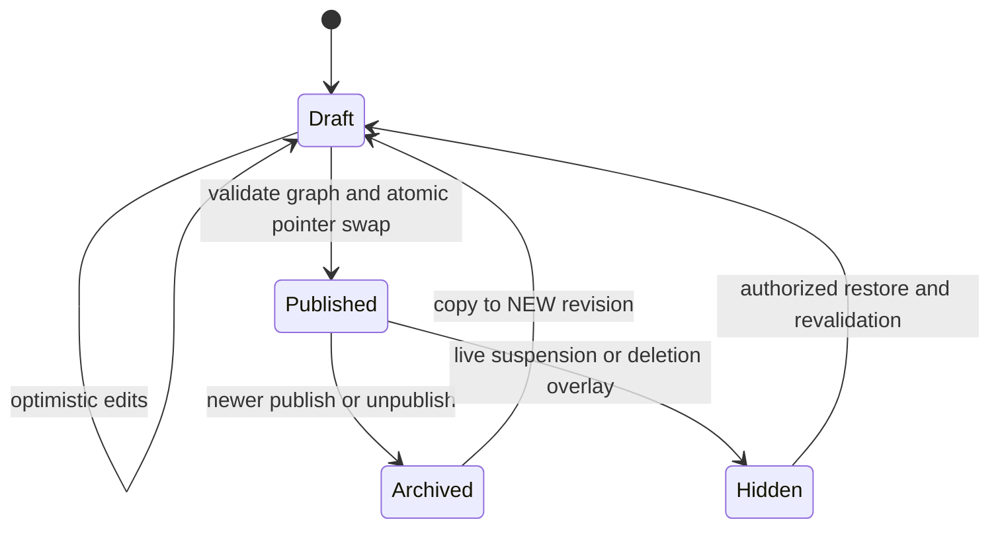
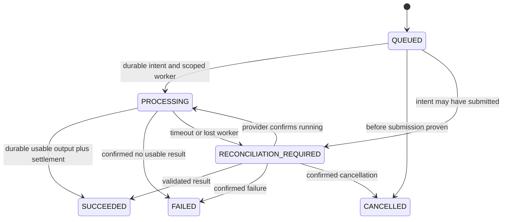

# Phase 02 — Entity Lifecycles

2026-09-17 • State-machine design; no implementation. [Schema](02_DATABASE_SCHEMA.md) uses text CHECK constraints; [domain model](02_DOMAIN_MODEL.md) defines atomic transitions. An HTTP success is returned only after required durable commit. All state changes require owner/action authorization and version checks where M is declared. Public reads always apply live eligibility.

## Users and identity

PENDING → ACTIVE after managed-provider onboarding/required verification. ACTIVE → SUSPENDED by scoped staff/security action; SUSPENDED → ACTIVE only after recorded review. PENDING/ACTIVE/SUSPENDED → DEACTIVATED through account closure; reactivation requires explicit policy and new authentication, never stale session reuse. Physical deletion/anonymization is separate deletion workflow; retained user shell has no active contact/credentials.

Email/phone verification timestamps verify contacts, not business identity. Changes clear matching verification, revoke sessions where required and reverify. Session rotation on login/step-up/privilege change; logout, suspension, expiry and recovery revoke authority. Platform grants can be revoked without deleting historical audit. Studio membership ACTIVE/INVITED/REVOKED: INVITED grants nothing; invitation delivery/token table deferred V1.5. Transfer/revoke under studio lock preserves at least one active OWNER for operable studio; studio deletion is the only permitted zero-owner operational exception.

## Studios

PENDING → ACTIVE when minimum onboarding valid; ACTIVE ↔ SUSPENDED through audited policy; PENDING/ACTIVE/SUSPENDED → DELETING → DELETED. DELETING rejects new user mutations, publication and AI submission; controlled cleanup/reconciliation continues under system purpose. DELETED is a minimal tombstone, not an active professional. Portfolio and project publication are separate from studio activity. Verification is an independent V1.5 fact with live expiry/revocation; ACTIVE never implies verified.

## Portfolios and projects

Portfolio root: UNPUBLISHED ↔ PUBLISHED; either → ARCHIVED, with explicit restore creating a validated draft. Portfolio version status DRAFT → PUBLISHED → ARCHIVED. Exactly one draft and at most one published version per root; archived previously published content remains immutable. Unpublish clears published pointer and archives prior current published version in same transaction. Archive/trash cannot leave live pointer active.

Project root: DRAFT → READY → PUBLISHED; DRAFT/READY can remain editable; publishing may validate and transition directly from DRAFT when all READY criteria are met. PUBLISHED → ARCHIVED on unpublish/archive; restore starts DRAFT/READY. A published root can simultaneously have a new DRAFT child: editing that child does not change root public state. Project revision statuses DRAFT → PUBLISHED → ARCHIVED, with required publish timestamps and frozen payload. READY is root validation status, not a fourth conflicting revision state.

Changing facts/media invalidates previous draft READY validation; final publish always revalidates. Old portfolio pins may read a project's archived published revision only while the project root is still public. Unpublishing portfolio does not automatically unpublish independent project URLs. Studio suspension or explicit unpublish-all denies both.

Trash D overlay sets deleted_at/purge_after under studio lock and revokes live references/grants; domain original state may remain for recovery but never grants access while deleted_at is set. Restore clears D fields only after reauthorization and current validation; it does not silently republish. Version restoration copies into a new draft; immutable historical payload never rewritten.

Diagram summarizes content revisions, not one combined root/status column. Payload immutability permits lifecycle metadata updates only through guarded transitions.

## Media, uploads and recipes

Canonical asset states retain Phase01/master spelling:
UPLOADING → QUARANTINED → VALIDATING → PROCESSING → READY.
Validation or processing may end FAILED; transient safe failures may retry VALIDATING/PROCESSING after bounded policy review. Hostile files stay unavailable and are purged after evidence policy. Any nonpurged asset may be TRASHED subject to reference-aware withdrawal; TRASHED → prior safe processing/READY state only after object/policy checks; TRASHED → PURGED after retention/cleanup. PURGED cannot be revived by a stale job.

UPLOADED from the Phase02 examples means accepted into QUARANTINED. DELETED is presentation grouping of TRASHED/PURGED. READY never means PUBLIC. Privacy class PRIVATE/CLIENT_SHARED/PUBLIC applies to use/delivery; original storage remains private in every state.

Upload sessions: OPEN → COMPLETED/CANCELLED/EXPIRED. COMPLETED only after pinning actual accepted object version/checksum and validated expected size; processing acceptance may still fail later. Grant expiry alone does not release pending-byte accounting until storage cleanup/reconciliation establishes actual retained bytes.

Recipe: PENDING → PROCESSING → READY or FAILED; READY → RETIRED on replacement/takedown. Variant PROCESSING → READY/FAILED; READY → RETIRED. READY recipe requires all declared variants present, correct immutable checksums, appropriate stamps and no forbidden source. Creating a replacement does not retire live old watermarked recipe until replacement ready; swap and outbox atomic. Retired origin/CDN cleanup asynchronous and monitored. Worker QUEUED → RUNNING → SUCCEEDED/FAILED/CANCELLED with fencing and lease expiry recovery.

## AI generation and provider attempts

Canonical persisted/API generation states:
QUEUED → PROCESSING → SUCCEEDED / FAILED / CANCELLED, with RECONCILIATION_REQUIRED reachable from QUEUED/PROCESSING whenever submission may have happened. Reconciliation resolves to PROCESSING (known running), SUCCEEDED (validated durable output), FAILED (known unusable/failure) or CANCELLED (confirmed cancellation with no usable completion). Terminal request/output history is immutable; regenerate creates a new child.

Exact Phase01 mapping: CREATED/RESERVED are request validation/reservation steps inside the creation transaction ending QUEUED; RUNNING=PROCESSING; CANCELED=CANCELLED; RECONCILING=RECONCILIATION_REQUIRED. No status downgrade to FAILED merely to make ordinary retries run.

Attempt: INTENT_RECORDED → SUBMITTED → RESULT_STAGED → SUCCEEDED; INTENT_RECORDED/SUBMITTED → UNKNOWN after uncertain network/crash; known rejection → FAILED; confirmed cancellation → CANCELLED. UNKNOWN resolved only with provider/callback/manual evidence. One potentially active attempt/generation. Safe pre-submit transport failure can retry the same attempt/key; new provider attempt only after proven nonexecution and policy authorization, never simply expired lease.

cancel_requested_at is an orthogonal request flag, not proof of provider cancellation. Reservation HELD → CONSUMED or RELEASED exactly once. Partial actual consumption releases remainder atomically; refund after consumption is a new ledger entry, not reversing reservation status. reconciliation_hold prevents expiry release. User credits settle only on usable durable success; provider costs remain independently recorded even for failures.

Client review grant validity is derived (not redundant status): now<expires_at AND revoked_at NULL AND current epoch AND resource eligible. V1 only reads included immutable outputs; V1.5 LIKE/COMMENT/APPROVE/REQUEST_CHANGE append history. Approval latest valid decision is scoped to specific output+review actor/session, never inherited by child generation. A new request-change/superseding approval preserves original event. Grant revocation ends future access and doesn't falsify past approval history.

## Leads

NEW → CONTACTED → SITE_VISIT → DESIGN → QUOTATION → NEGOTIATION → WON or LOST is typical progression, not forced navigation. Any active nonterminal state may advance/return to another active state or close WON/LOST by authorized studio action with a history row. Reopen WON/LOST to active state requires reason, permission and audit. Same-state edit adds no fake transition. Initial capture writes null→NEW. lead.version unique per transition prevents duplicate history.

V1 exposes NEW/CONTACTED/WON/LOST basic handling; full intermediate workflow, assignee/follow-up reminders remain V1.5 feature-gated while schema supports the complete pipeline. Notes private; customer message not rewritten as a staff note. Trash hides normal inbox but respects business/privacy retention; restoring preserves actual history. Follow-up instant and intended IANA timezone remain paired.

## Reviews and moderation (V1.5, except V1 reports)

Review root DRAFT → PENDING → PUBLISHED or REJECTED; PUBLISHED → HIDDEN on moderation/withdrawal. New edit creates new pending revision; previous published revision can remain visible until approval unless policy withdraws it. Approval atomically switches pointer; rejection never overwrites approved text. Review revision moderation status PENDING/APPROVED/REJECTED. Only current approved published pointer rendered with live moderation/eligibility checks. Customer authorship and legitimate relationship evidence validated; anonymous testimonials are not verified reviews.

Report OPEN → INVESTIGATING → ACTIONED/DISMISSED → CLOSED; ACTIONED/DISMISSED/CLOSED → APPEALED → INVESTIGATING with new action event. Assignment/action/appeal history append-only. Actual resource restriction occurs in owning module plus audit in same database transaction; a report state alone does not secure the image. Public reporting reveals no private target existence.

## Verification (V1.5)

PENDING → SUBMITTED → UNDER_REVIEW → VERIFIED or REJECTED; VERIFIED → EXPIRED or REVOKED. Revised evidence after rejection/revocation creates a new linked request; old decision remains. PHONE/IDENTITY/BUSINESS/ADDRESS targets studio; PROJECT targets exact studio project. Contact OTP is not automatically ID/business verification. Expired/revoked badge removed via live check even before cache event. Review requires staff case/step-up; evidence never public, separate retain_until policy.

## Subscriptions and payments

PENDING → TRIALING/ACTIVE on authoritative assignment/verification; TRIALING → ACTIVE/CANCELLED/EXPIRED; ACTIVE → PAST_DUE/PAUSED/CANCELLED/EXPIRED; PAST_DUE → ACTIVE/PAUSED/CANCELLED/EXPIRED; PAUSED → ACTIVE/CANCELLED. At most one current subscription assignment per studio; previous completed rows retained. Free pilot may be ACTIVE with no provider refs, not fake paid success. cancel_at_period_end is a request flag; authoritative period/status determines access.

No plan grant from browser return. Period renewal locks current subscription and usage account, dedups grant by provider period/server operation; old reservations stay bound to original period. Downgrade preserves readable existing work, may make consumed>new limit, blocks new consumption without deleting assets. Provider outages follow recorded authoritative policy, not unlimited grace invented by UI.

Payment PENDING → SUCCEEDED/FAILED/RECONCILIATION_REQUIRED; unknown resolves after verification. Refund/dispute are separate transactions linked to original, not editing amount history. Webhook RECEIVED → PROCESSED/REJECTED/RECONCILIATION_REQUIRED; duplicate provider event returns acknowledged existing outcome only after durable acceptance. Out-of-order events cannot regress newer provider state; unknown provider sequence triggers authoritative fetch/recheck.

## Supporting operational states

Outbox dispatch PENDING → SENDING → DISPATCHED; safe expired lease→PENDING; exhausted→DEAD with alerted replay permission. DISPATCHED means broker accepted, not all consumers completed. Consumer receipt committed with effect.

Notification QUEUED → SENDING → DELIVERED/FAILED/UNKNOWN; provider timeout UNKNOWN, not certain failure. Reconcile before duplicate retry when provider permits; don't promise exactly-once delivery. Optional preferences separate from critical security notices.

Deletion REQUESTED → RESTRICTED → RETENTION_CHECK → PURGING → COMPLETED, with BLOCKED and CANCELLED where policy permits. Request in BLOCKED is still access-restricted; export follows REQUESTED→PREPARING→COMPLETED/FAILED and expires private artifact. Per-task PENDING/RUNNING/SUCCEEDED/FAILED/BLOCKED. Mark COMPLETED only after required receipts and tombstones; user shell/legal retention exception documented, not silently skipped.

Custom domain deferred REQUESTED → VERIFIED → PROVISIONING → ACTIVE → SUSPENDED/REMOVING → REMOVED; lost proof/TLS denies host and restores platform canonical. Fresh proof required before reactivation/reassignment. Feature flag changes audited version increments; flags cannot override any lifecycle gate.

## Enforcement boundary

CHECK constraints enforce allowed states and static paired fields. Owner commands and guarded transition triggers enforce old→new edges, version comparison and immutability. Deferred constraint triggers verify root pointer/child state and active-owner invariants at commit. Cross-row checks are never written as plain CHECK expressions. Every terminal/publish/ledger transition has rollback, race, redelivery and unauthorized-actor tests in its implementation phase; none run here.

