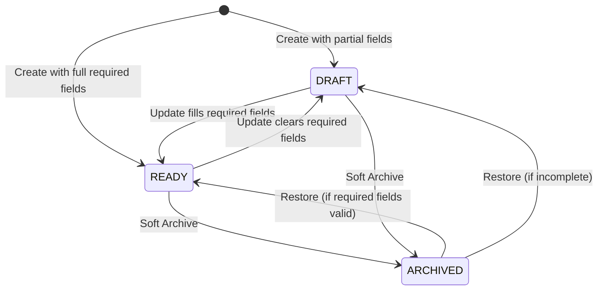
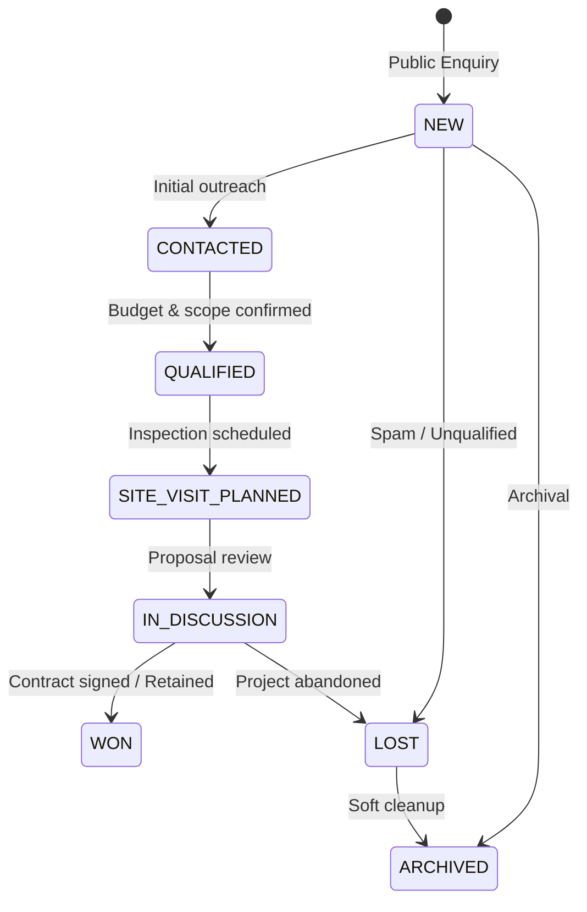

# Elégance — Project, Lead & Client Workflow Architecture (Phase 7B)

## 1. Executive Summary & Domain Scope

Phase 7B establishes hardened, multi-tenant state machines and collaboration invariants across the three primary commercial pillars of the Elégance Interior Designer Platform:
1. **Professional Projects**: Draft, readiness evaluation, publishing gates, explicit unpublishing, soft archive, and restore workflows.
2. **Public Enquiries & CRM Leads**: Anti-abuse public enquiry intake, strict studio resolution, same-studio project attribution, lead lifecycle transitions, active member assignment, and note audit trails.
3. **Client Collaboration & Reviews**: `WON` lead review unlocks, one-time secure review tokens, client design feedback loops, and multi-studio isolation.

---

## 2. Professional Project Lifecycle & State Invariants

### 2.1 State & Visibility Taxonomy
Projects are governed by two orthogonal dimensions:
- **`ProjectStatus`**: `DRAFT`, `READY`, `ARCHIVED`
- **`VisibilityStatus`**: `PRIVATE`, `PORTFOLIO`



### 2.2 Readiness Invariants
A project automatically calculates readiness based on mandatory metadata invariants:
- Non-blank `title`
- Valid `categoryCode`
- Non-blank `shortDescription`
- Non-blank `city`
- Non-blank `state`

### 2.3 Publishing Gates & Hard Invariants
To achieve `VisibilityStatus.PORTFOLIO` (public display), a project MUST satisfy:
1. **Readiness Invariant**: Status must be `READY`. Draft projects can never have `PORTFOLIO` visibility.
2. **Archive Invariant**: Archived projects cannot be published or set to `PORTFOLIO` visibility.
3. **Active Studio Invariant**: The publishing studio must exist and have account status `ACTIVE`.
4. **Media Reporting**: `ProjectPublishCheckResponse` inspects public portfolio photos and room assets, providing diagnostics (`hasPublicMedia`) and explicit blockers.
5. **Role Invariant**: Only authenticated elevated studio members (`DESIGNER_ADMIN`, `OWNER`, `ADMIN`) or platform super administrators can publish or unpublish.
6. **Optimistic Concurrency**: Publish and unpublish operations accept the expected project `version`, preventing race conditions or clobbered edits.
7. **Publish Idempotency**: Publishing an already published project returns the current state idempotently without duplicate audit events.

### 2.4 Soft Archive vs Hard Deletion
Projects are never permanently deleted through ordinary CMS workflows. Archival is transactional and soft:
- Sets `archived_at = CURRENT_TIMESTAMP` and `project_status = 'ARCHIVED'`.
- Preserves all associated rooms, photographs, lead attributions, and client review associations.
- `findPortfolioProjects` query strictly enforces `project_status = 'READY' AND visibility_status = 'PORTFOLIO' AND archived_at IS NULL`.

---

## 3. Public Enquiry & CRM Lead Lifecycle

### 3.1 Public Intake & Abuse Hardening
Public enquiries are submitted via `PublicLeadService.createPublicLead`:
- **Honeypot Validation**: Rejects automated submissions with hidden honeypot fields populated.
- **Rate Limiting**: Tiered IP rate limiting (5 enquiries per 15 minutes), phone flood protection (3 enquiries per phone number per hour), and studio target throttling (30 per 5 minutes).
- **Slug Resolution**: Resolves target studio slug safely without leaking internal UUIDs or unpublished drafts.
- **Project Attribution**: If a `projectSlug` is provided, the system validates that the project exists, is published, and belongs to the specified studio.

### 3.2 Lead State Machine
Leads transition through strict CRM stages:


### 3.3 Assignment & Project Attribution Safety
- **Member Assignment**: Leads can only be assigned to verified, active team members belonging to the same studio (`leadRepository.isStudioMember`). Assigning non-members or cross-studio users throws `BadRequestException`.
- **Project Association**: When linking a project to a lead in `LeadService.updateLead`, the system enforces `leadRepository.isStudioProject(studioId, projectId)`. Cross-studio project attribution throws `BadRequestException`.
- **Optimistic Concurrency**: Updates verify lead `version`. Concurrent updates trigger `ConflictException` (HTTP 409).

---

## 4. Client Collaboration & Review Trust Model

### 4.1 Verified Review Unlock Invariant
Reviews cannot be submitted anonymously or fabricated by designers.
- A designer can only invite a client for a verified review if the corresponding CRM lead has achieved status **`WON`**.
- `ReviewInvitationService.createReviewInvitation` enforces:
  ```java
  if (lead.status() != LeadStatus.WON) {
      throw new BadRequestException("Review invitations can only be issued for leads marked as WON.");
  }
  ```
- Generates a cryptographically random, one-time invitation token (`review_invitations`) valid for 30 days.

### 4.2 Client Review Sessions
- Client concept reviews are handled through tokenized session access (`ai_client_reviews`, `ai_client_review_sessions`).
- Clients can inspect rendering variations, leave spatial pin annotations, and submit approval decisions without requiring designer credentials or exposing sensitive studio operational data.

---

## 5. Multi-Tenant Isolation & Error Contracts

1. **Row-Level Security (RLS)**:
   - PostgreSQL RLS policies enforce `studio_id` isolation across `studio_projects`, `project_rooms`, `project_photos`, `leads`, `lead_notes`, `client_reviews`, and `studio_members`.
2. **Application Tier Validation**:
   - `ActorContext` verifies user authentication, account suspension/active status, and studio membership before every mutation.
   - Cross-tenant requests produce strict `403 FORBIDDEN` or `404 NOT FOUND` responses without leaking existence of resources across studio boundaries.
